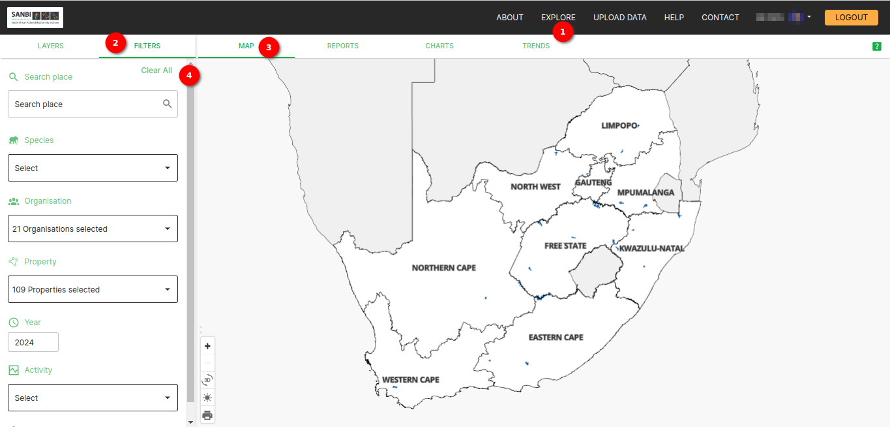
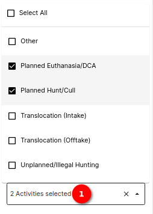
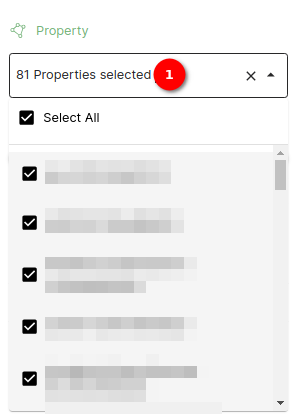

# Filter Side Panel Documentation

The filter side panel allows users to refine and narrow down data based on specific criteria. There are different types of filters are available for customisation.
The filter side panel enhances the user experience by allowing them to focus on specific subsets of data based on their preferences, making it easier to analyse and work with the dataset effectively.

## Viewing the filters

1. **Explore:** Open the Explore page by clicking on `EXPLORE` on the navigation bar.
2. **Filter:** Open the filter side panel by clicking on the `FILTERS` option. Inside the side panel, the user will find all of the filters. For each filter, a user can interact with the available options or input fields to customise their filter criteria. The user can click on the dropdown and select the filter.

## Filter side panel overview

### Filter Types

#### 1. Search place Filter

* **Filter Description:** This filter allows users to search for places.
* **Usage:** Click on the search place field and type letters to search for places.

1. **Search place:** Click on the search place to filter places.

#### 2. Species Filter

* **Filter Description:** The species filter allows users to filter data by species.
* **Usage:** Choose a species from the list to view data specific to that species.

1. **Searching for Species:** Click on the Species Filter dropdown. A user will see a list of available species. A user can start typing the name of the species they are looking for in the search box provided. As the user types, the list will dynamically filter to display matching species. The user can select the species that they want to filter from the list.
2. **Single-Select Functionality:** The Species Filter allows the user to select only one species at a time. If the user selects a different species, the filter will replace the previous selection with the newly chosen species.

#### 3. Activity Filter

* **Filter Description:** This filter allows users to narrow down data based on an activity type.
* **Usage:** Filter data based on an activity type.

1. **Select:** Select the activity type to filter the data based on the activity type.

#### 4. Organisation Filter

* **Filter Description:** This filter allows users to filter data according to the organisation.
* **Usage:** Select an organisation from the dropdown menu to filter data specific to that organisation.
* **Permission:** `Can view organisation filter` permission must be added to the Group on the admin page, 
to make a user group e.g. `National data scientist` able to see the organisation filter.

1. **Selecting All Organisations:** To view data from all organisations, simply check the "Select All" option within the Organisation Filter.
2. **Selecting Individual Organisations:** To filter data for specific organisations, a user can follow these steps:
    * Uncheck the "Select All" option if it is selected.
    * A list of available organisations will be displayed.
    * Check the checkboxes next to the organisations the user wants to include in the filter.
3. **Cross Icon**: Click on the `Cross` icon to clear organisation filter.

#### 5. Property Filter

* **Filter Description:** The property filter helps users filter data based on properties. This filter is dependent on the organisation filter. 
It means the options will be based on the selected organisations.
* **Usage:** Select a property from the available options to view data related to that property.
* **Permission:** The `can view property filter` permission must be added to the group on the admin page, 
to allow the user group (e.g. `National data scientist`) to see the property filter.

1. **Select All:** `Select All` of the properties.
2. **Show selected property count:** A user will see the count of the property selected.
3. **Cross Icon**: Click on the `Cross` icon to clear the property filter.

#### 6. Year Range Filter

* **Filter Description:** This filter allows users to narrow down data based on a specified year range.
* **Usage:** Set a range of years to view data within that time frame. For example, selecting a range of "2010-2020" will display data recorded between 2010 and 2020.

1. **Year range bar:** This is the bar that is used for setting the year range.
2. **From:** Input field for the from (starting) year value.
3. **To:** Input field for the to (ending) year value.

#### 7. Spatial Filter

* **Filter Description:** This filter allows users to filter data based on spatial information.
* **Usage:** Specify spatial criteria to view data located within a specific geographical area.

1. **Critical biodiversity type dropdown** Using this, the user can filter the data according to the critical biodiversity areas.
2. **Ecosystem dropdown:** Using this, the user can filter the data according to the ecosystem types.

8. **Clear All**: Click on the `Clear All` button to clear all the filters.

#### Report Type Filter

* **Filter Description:** This filter allows users to filter data based on report types. This filter appears on the reports tab. 
* **Usage:** Choose a report type from the list to view data associated with that report type.

1. **Report type:** The Report Type Filter is a multi-select filter that enables users to filter data based on specific report types or view data of all the report types. With this filter, users can easily narrow down their dataset to view data associated with a particular report type.

## Summary

The filter side panel provides a robust toolset for users to refine and explore their datasets effectively. Whether it's searching for specific places, species, or filtering by activities, organisations, properties, years, or spatial criteria, this comprehensive manual ensures users can seamlessly navigate and utilise the filtering functionalities for a more tailored data analysis experience.
