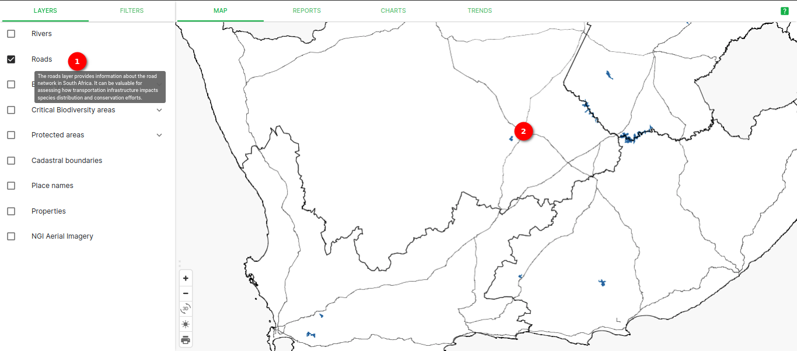
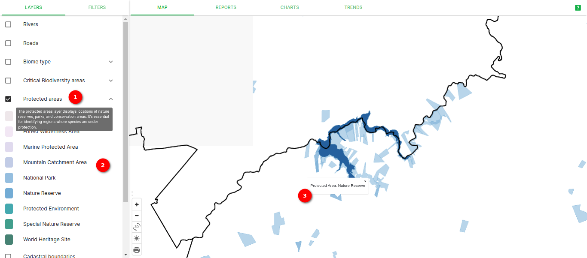
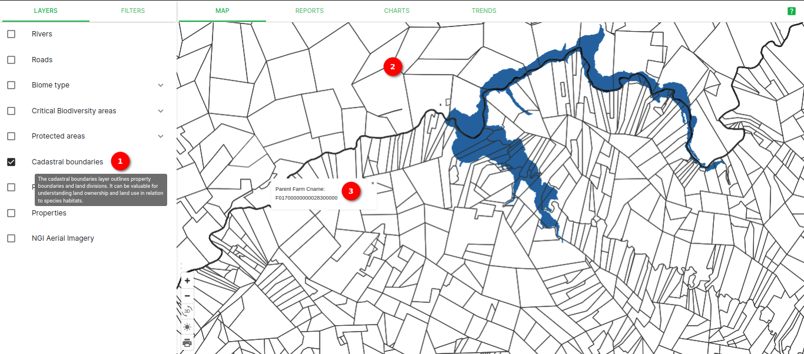
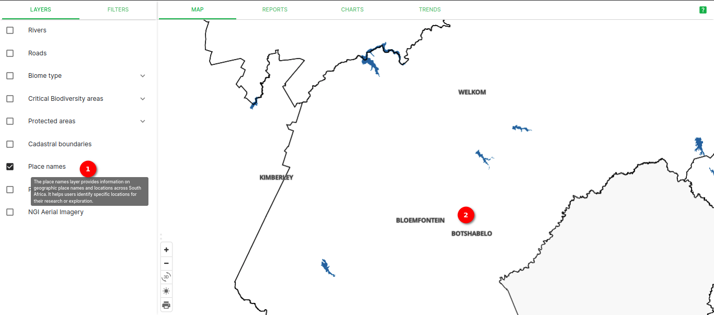
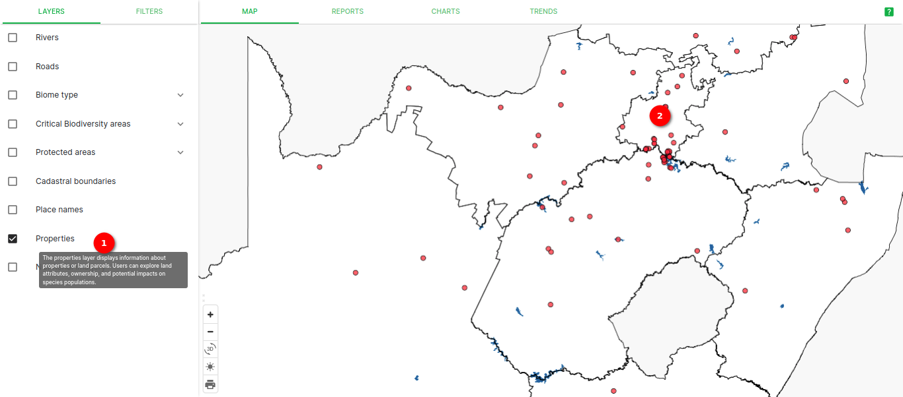
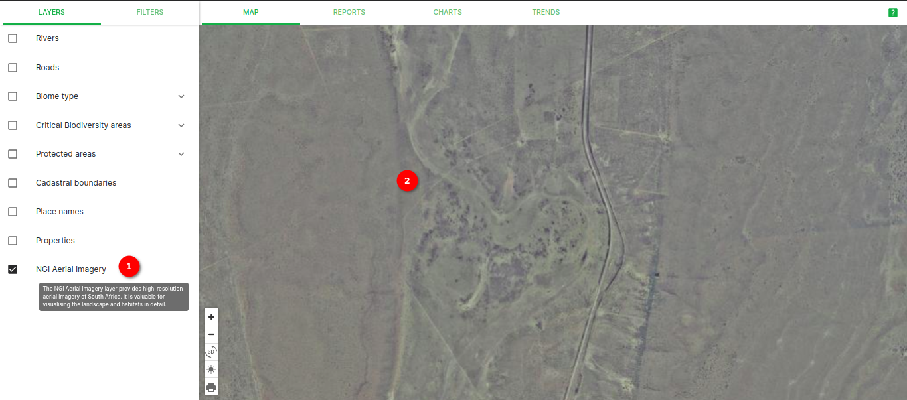

# Layers

Welcome to the documentation for map layers available in application. This document provides an overview of the map layers, how to access them, and how to interact with and customise their appearance.

**Layers**

1. **Layers**: By clicking on the `LAYERS` user will able to see the available layers.

2. **Map**: By clicking on the `MAP` user will able to see map visualisation.

3. **Available Layers**: Available layers side panel, user can use this layers for better visualisation.

## Map layers

1. **Rivers Layer**: The `Rivers Layer` displays the major rivers and water bodies across South Africa. This layer is useful for understanding the hydrography of the region.

    

    1. **Rivers**: `Rivers` layer allows user to see the rivers on map.

    2. **Rivers On Map**: Blue lines displays the rivers on map.

    * **Layer Visibility**: You can control the visibility of the Rivers layer using the checkbox provided. To show or hide the layer on the map, simply check or uncheck the box next to rivers.

2. **Roads Layer**: The `Roads Layer` provides information about the road network in South Africa. It can be valuable for assessing how transportation infrastructure impacts species distribution and conservation efforts.

    

    1. **Roads**: `Roads` layer allows user to see the roads on map.

    2. **Roads On Map**: Thin white lines displays the roads on map.

    * **Layer Visibility**: You can control the visibility of the roads layer using the checkbox provided. To show or hide the layer on the map, simply check or uncheck the box next to roads.

3. **Biome Type Layer**: The `Biome Type Layer` illustrates the various biomes and ecosystems in South Africa. This layer is essential for understanding the different habitats where species are found.

    

    1. **Biome Type**: The `Biome Type` layer allows users to visualise different biomes and ecosystems on the map.

    2. **Biome Type Dropdown**: The dropdown displays the names of biome types, with unique colors for easy identification.

    3. **Ecosystem Type**: The map displays ecosystem type name.

    * **Layer Visibility**: You can control the visibility of the biome type layer using the checkbox provided. To show or hide the layer on the map, simply check or uncheck the box next to biome type.

4. **Critical Biodiversity Areas Layer**: The `Critical Biodiversity Areas` layer highlights regions of significant ecological importance and high species diversity. It aids in identifying key areas for conservation efforts.

    

    1. **Critical Biodiversity Areas**: The `Critical Biodiversity Areas` layer provides essential information about regions with high ecological importance and species diversity in South Africa.

    2. **Biodiversity Areas Dropdown**: The dropdown displays the names of critical biodiversity areas, with unique colors for easy identification.

    3. **Ecosystem Type**: The map highlights and labels specific ecosystem types found within the critical biodiversity areas.

    * **Layer Visibility**: You can control the visibility of the critical biodiversity areas layer using the checkbox provided. To show or hide the layer on the map, simply check or uncheck the box next to critical biodiversity areas.

5. **Protected Areas Layer**: The `Protected Areas` layer displays locations of nature reserves, parks, and conservation areas. It's essential for identifying regions where species are under protection.

    

    1. **Protected Areas**: The `Protected Areas` layer provides information about designated areas that are under protection, including nature reserves, parks, and heritage sites in South Africa.

    2. **Protection Areas Dropdown**: The dropdown displays the names of various protected areas, often associated with unique colours for easy identification.

    3. **Protected Area**: The map highlights and labels the specific types of protected areas, such as national parks, wildlife reserves, or heritage sites.

    * **Layer Visibility**: You can control the visibility of the protected areas layer using the checkbox provided. To show or hide the layer on the map, simply check or uncheck the box next to protected areas.

6. **Cadastral Boundaries Layer**: The `Cadastral Boundaries` layer outlines property boundaries and land divisions. It can be valuable for understanding land ownership and land use in relation to species habitats.

    

    1. **Cadastral Boundaries**: The `Cadastral Boundaries` layer provides information about property boundaries and land divisions in South Africa.

    2. **Property Boundaries Display**: White lines on the map indicate the property boundaries and land divisions.

    * **Layer Visibility**: You can control the visibility of the Cadastral Boundaries layer using the checkbox provided. To show or hide the layer on the map, simply check or uncheck the box next to cadastral boundaries.

7. **Place Names Layer**: The `Place Names` layer provides information on geographic place names and locations across South Africa. It helps users identify specific locations for their research or exploration.

    

    1. **Place Names**: The `Place Names` layer offers a comprehensive collection of geographic place names and locations throughout South Africa.

    2. **Place Names on Map**: This layer displays the names of towns, and various geographic points of interest on the map.

    * **Layer Visibility**: You can control the visibility of the place names layer using the checkbox provided. To show or hide the layer on the map, simply check or uncheck the box next to place names.

8. **Properties Layer**: The Properties Layer displays information about properties or land parcels. Users can explore land attributes, ownership, and potential impacts on species populations.

    

    1. **Properties**: The `Properties` layer provides detailed information about land parcels and properties within South Africa.

    2. **Property on Map**: This layer displays properties on map.

    * **Layer Visibility**: You can control the visibility of the properties layer using the checkbox provided. To show or hide the layer on the map, simply check or uncheck the box next to properties.

9. **NGI Aerial Imagery Layer**: The `NGI Aerial Imagery` layer provides high-resolution aerial imagery of South Africa. It is valuable for visualising the landscape and habitats in detail.

    

    1. **NGI Aerial Imagery**: The `NGI Aerial Imagery` layer offers high-resolution aerial imagery of South Africa, allowing users to view the landscape and habitats in fine detail.

    2. **Aerial Imagery on Map**: The map displays aerial imagery in high resolution, offering a clear and detailed view of the landscape.

    * **Layer Visibility**: You can control the visibility of the NGI aerial imagery layer using the checkbox provided. To show or hide the layer on the map, simply check or uncheck the box next to NGI aerial imagery.

* **Displaying All Layers on the Map**: User can display multiple layers simultaneously to enhance data exploration experience. To display all layers on the map just select all the layers from the side panel. User can also select specific layers according to his/her need.

    

    1. **All Selected Layers**: All the selected layers on the side panel.

    2. **Map Visualisation**: Map visualisation after selecting all layers.

    3. **Names**: Popup displaying names of ecosystem type, critical biodiversity area, and protected area of pointed property.

## Summary
This documentation provides a comprehensive overview of the map layers available in our application. These layers serve as essential tools for exploring South Africa's geography and ecological data. From rivers and roads to critical biodiversity areas, each layer offers unique insights into the region's natural and infrastructural features. Users can select and display multiple layers simultaneously, facilitating in-depth research and analysis. By leveraging these map layers, researchers, conservationists, environmentalists, and geospatial analysts can better understand and protect South Africa's diverse landscapes and ecosystems.
