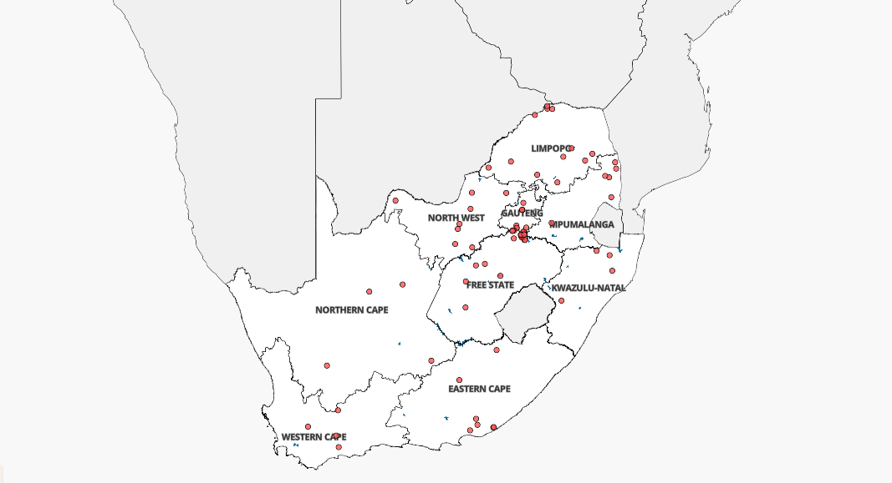

# Map Functionalities Documentation

This documentation outlines the functionalities available in the map view, including features that allow the user to interact with and customise the map display for their needs.

### Map

1. **Map**: The `Map` tab.

2. **Zooming In Icon**: The zooming-in icon is represented by a plus sign (+). Click on this icon to zoom in on the map, making features and details appear larger and more visible.

3. **Zooming Out Icon**: The zooming out icon is represented by a minus sign (-). Click on this icon to zoom out on the map, reducing the size of the displayed area and providing a broader view.

4. **Toggle Between Dark and Light Mode**: The map view offers the option to toggle between dark and light modes, enhancing the viewing experience based on the user's preference.

    **Dark Mode**

    

    * **Dark Mode (Moon Icon):** Click on the moon icon to switch to dark mode, which provides a darker color scheme suitable for low-light or night-time viewing.

    **Light Mode**

    

    * **Light Mode (Sun Icon):** Click on the sun icon to switch to light mode, offering a brighter color scheme for daytime or well-lit environments.

5. **Printing Out the Current Map Preview**: The print icon allows the user to generate a physical or digital copy of the current map preview. When clicked, this icon initiates the printing process, enabling the user to obtain a hard copy or a digital image of the map for reference or sharing.

- **Species Population Range Indicator**: The chart uses a gradient of colors to smoothly represent the varying population densities. Users can quickly assess the concentration of species in different regions based on the color intensity. Users can use this chart to analyse and interpret the population distribution of selected species across different geographical areas, distinguishing between low, moderate, and high population densities.

- **Highlighting The Most Populated Region**: The map dynamically identifies and highlights the region with the population density for the selected species. This region is visually emphasised to draw the user's attention to the area with the most significant concentration of the chosen species.

- **Compass Icon**: The `Compass Icon` serves as a visual guide within the map view, enhancing the user's ability to explore a 3D representation of the environment. Represented by a compass symbol, this icon provides users with a quick reference to the cardinal directions, facilitating orientation while navigating the 3D map. The Compass Icon dynamically adjusts its orientation based on the user's movements, consistently pointing toward the geographic north. Users can interact with the icon to reset the map orientation to its default north-facing position

## Summary

The Map Functionalities provide users with a comprehensive set of tools for a flexible and tailored map exploration experience. Users can seamlessly adjust the view with zoom functionalities, allowing for detailed examinations or broader perspectives. The option to toggle between Dark and Light Modes ensures optimal visibility in diverse lighting conditions.

Furthermore, the inclusion of a 3D view enriches the exploration possibilities, offering users an immersive and dynamic environment. The print functionality enables users to capture and share their preferred map views, in 2D or 3D. This suite of features empowers users with enhanced control and convenience, ensuring a versatile and enjoyable map interaction.
