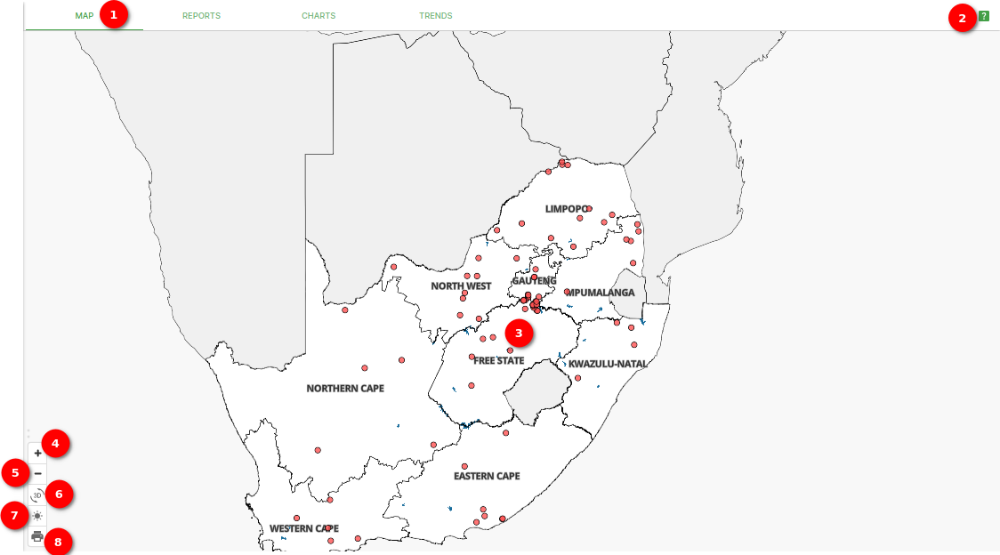

# Map Functionalities Documentation

## Overview

This documentation outlines the functionalities available in the map view, including features that allow you to interact with and customize the map display for your needs.

### Map

1. **Map**: The `Map` tab.

2. **Zooming In Icon**: The zooming in icon is represented by a plus sign (+). Click on this icon to zoom in on the map, making features and details appear larger and more visible.

3. **Zooming Out Icon**: The zooming out icon is represented by a minus sign (-). Click on this icon to zoom out on the map, reducing the size of the displayed area and providing a broader view.

4. **Toggle Between Dark and Light Mode**: The map view offers the option to toggle between dark and light modes, enhancing the viewing experience based on your preference.

    **Dark Mode**

    

    * **Dark Mode (Moon Icon):** Click on the moon icon to switch to dark mode, which provides a darker color scheme suitable for low-light or night-time viewing.

    **Light Mode**

    

    * **Light Mode (Sun Icon):** Click on the sun icon to switch to light mode, offering a brighter color scheme for daytime or well-lit environments.

5. **Printing Out the Current Map Preview**: The print icon allows you to generate a physical or digital copy of the current map preview. When clicked, this icon initiates the printing process, enabling you to obtain a hard copy or a digital image of the map for reference or sharing.

## Summary

The map functionalities provide you with options to adjust the map's view and appearance to best suit your needs. You can zoom in or out to focus on specific details or gain a broader perspective. Additionally, the ability to toggle between dark and light modes enhances viewing comfort. The print functionality allows you to create a hard or digital copy of the current map view for your convenience.
