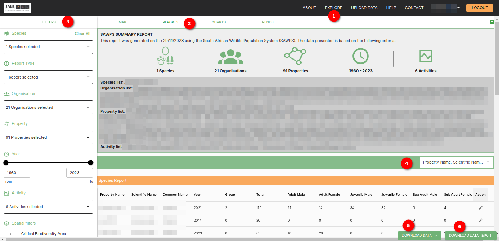
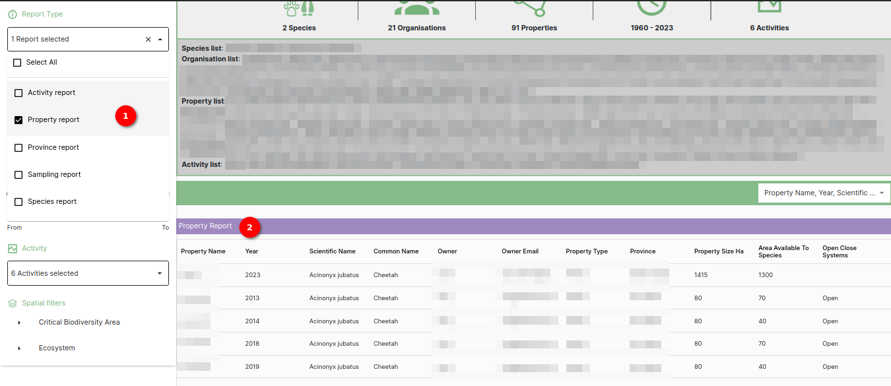
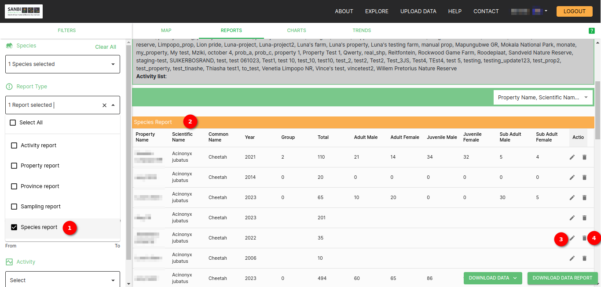
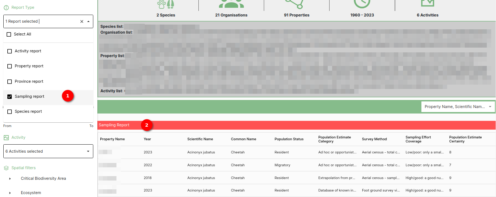

# Reports Table Page Documentation

The Reports Table Page is the central hub for viewing and interacting with the user's data. This page offers a user-friendly interface for exploring and manipulating the user's dataset. Users can use a variety of features to customise their data view, including filters, column search, and data export options.

## Reports Display

The main area of the page displays the user's dataset in a tabular format. Each row represents a record, and each column represents a data attribute.

### Reports table

1. **Explore**: Click on the `EXPLORE` link available on the navigation bar to open explore page.
2. **Reports**: Click on the `REPORTS` link to view the data.
3. **Filters**: Utilise the filters provided on the page to refine the user's data view. These filters include:
     * **Organisation Filter:** Filter data by organisation.
     * **Report Type Filter:** Filter data by report type.
     * **Property Filter:** Filter data by property.
     * **Year Range Filter:** Filter data by a specified year range.
     * **Species Filter:** Filter data by species.
     * **Activity Filter:** Filter data by activity type.
     * **Spatial Filter:** Filter data by spatial criteria.

     * **Applying Filters:**
         * Click on the respective filter dropdowns.
         * Set filter criteria.
         * Click on the filter to update the data display based on the user's filter selections.
     * Each filter is designed to help the user narrow down their dataset to view only the data that's relevant to their analysis.

4. **Column Search**: Users can search for specific values within columns by selecting the column. This feature is especially useful when the user needs to locate specific data points within a large dataset. The table will dynamically filter to display selected column.
5. **XLSX Format:** Click on the `DOWNLOAD DATA REPORT` button to download the current dataset in XLSX format.
6. **CSV Format:** Click on the `DOWNLOAD DATA CSV` button to download the current dataset in CSV format.

### Report Type

* **Activity Report:** Report on activity basis.
* **Property Report:** Report on property basis.
* **Species Report:** Report on species basis.
* **Province Report:** Report on province basis.
Only member of `National data consumer` group can see this report.
* **Sampling Report:** Filter data by property.
Member of `National data consumer` or `Regional data consumer` **CAN NOT** see this report.

User group is configurable from the User Table in the [Django Admin](../../../administrator/manual/django-admin.md).

#### Activity Report

Activity Report columns consisted of base columns and custom columns.

1. **Base columns**: Hardcoded.
2. **Custom columns**: Configurable from the Django admin site by the site administrator.

See Activities section in the [Django Admin](../../../administrator/manual/django-admin.md) for the details.

### Reports Page with Reports Filter

#### Report Type Filter

1. **Report Type**: Report type filter with the reports type.

2. **Species**: The species icon displays with the scientific name of the selected species.

3. **Organisation**: The organisation icon displays with the count of selected organisations.

4. **Property**: The property icon displays with the count of selected properties.

5. **Clock Icon**: The clock icon serves as a visual indicator for the year range filter with year range.

6. **Activity**: The activity icon displays with the count of selected activities.

7. **Organisation List**: Show the name of the selected organisations.

8. **Property List**: Show the name of the selected properties.

9. **Activity List**: Show the name of the selected activities.

     **Activity Report Filter**

     

     1. **Activity Report**: Selected `Activity report`.

     **Activity Report Tables**

     

     **Activity Types**

     The Activity Report includes information for the following activity types:

     1. **Translocation (Intake)**: This table provides details on translocation activities related to the intake of species, for properties per year.

     2. **Translocation (Offtake)**: This table displays information about translocation activities related to off-take,  for properties per year.

     3. **Planned Hunt/Cull**: This table contains data related to planned hunting or culling activities,  for properties per year.

     4. **Planned Euthanasia/DCA**: This table presents information on planned euthanasia or disease control activities, for properties per year.

     5. **Unplanned/Illegal Hunting**: This table offers insights into unplanned or illegal hunting activities,  for properties per year.

     **Table Columns**

     Each of the tables associated with the activity types contains the following columns:

     * **Property Name**: The name of the property where the activity took place.
     * **Scientific Name**: The scientific name of the species involved in the activity.
     * **Common Name**: The common name of the species.
     * **Year**: The year in which the activity occurred.
     * **Total**: The total count of the species involved in the activity.
     * **Adult Male**: The count of adult male individuals.
     * **Adult Female**: The count of adult female individuals.
     * **Juvenile Male**: The count of juvenile male individuals.
     * **Juvenile Female**: The count of juvenile female individuals.

     **Summary**

     The `Activity Report` is a valuable filter for generating detailed reports on a variety of wildlife management activities. It provides specific information for each activity type, including property details, species information, and counts related to the activities. This report allows for a comprehensive view of wildlife management efforts, enabling informed decision-making and analysis of data related to different activities.

     **Property Report**

     

     1. **Property Report**: Selected `Property report`.

     2. **Property Table**: Property table displays data for the properties.

     **Report Columns**

     The Property Report includes the following columns:

     * **Property Name**: The name of the property being reported on.

     * **Scientific Name**: The scientific name of the species associated with the property.

     * **Common Name**: The common name of the species related to the property.

     * **Owner**: The name of the owner of the property.

     * **Owner Email**: The email address of the property owner.

     * **Property Type**: The type of the property.

     * **Province**: The province where the property is situated.

     * **Property Size (Ha)**: The size of the property in hectares.

     * **Area Available To Species**: The portion of the property that is available for species habitat.

     * **Open/Close Systems**: Indicates whether the property employs open or closed systems for wildlife management.

     **Summary**

     The `Property Report` is a critical filter for reporting on various properties. It provides information on property details, ownership, type, location, and specific data related to species habitat and wildlife management systems. This report is essential for analysing and managing property-related information in an organised and structured manner.

     **Species Report**

     

     1. **Species Report**: Selected `Species report`.

     2. **Species Table**: Species report table displays data of the species for the property.

     **Report Columns**

     The Species Report includes the following columns:

     * **Property Name**: The name of the property associated with the species data.

     * **Scientific Name**: The scientific name of the species.

     * **Common Name**: The common name of the species.

     * **Year**: The specific year for which the data is recorded.

     * **Group**: Information about the group which the species belongs.

     * **Total**: The total count of the species in the specified year.

     * **Adult Males**: The count of adult male individuals within the species.

     * **Adult Females**: The count of adult female individuals within the species.

     * **Juvenile Males**: The count of juvenile male individuals within the species.

     * **Juvenile Females**: The count of juvenile female individuals within the species.

     * **Sub-Adult Males**: The count of sub-adult male individuals within the species.

     * **Sub-Adult Females**: The count of sub-adult female individuals within the species.

     **Summary**

     The Species Report is a vital filter for reporting on various species. It provides comprehensive information on species-specific data, including counts, age groups, and associated property details. This report is essential for detailed analysis and management of species-related information.

     **Sampling Report Documentation**

     

     1. **Sampling Report**: Selected `Sampling report`.

     2. **Sampling Table**: Sampling report table displays data of the species for the property.

     **Report Columns**

     The Sampling Report includes the following columns:

     * **Property Name**: The name of the property where the sampling and population estimates were conducted.

     * **Scientific Name**: The scientific name of the species under consideration.

     * **Common Name**: The common name of the species.

     * **Population Status**: Indicates the status of the species population such as `Migratory` or `Resident`.

     * **Population Estimate Category**: Categorises the population estimate.

     * **Survey Method**: Describes the method used for surveying and data collection.

     * **Sampling Effort Coverage**: Indicates the extent to which the sampling effort covered the entire population or habitat.

     * **Population Estimate Certainty**: Represents the level of certainty of estimated population.

     **Summary**

     The Sampling Report is a crucial tool for documenting and reporting on sampling efforts and population estimates for different species. It provides detailed information on property details, species information, and key metrics related to the population and the methods used for data collection. This report is essential for assessing population health and the effectiveness of conservation and management efforts.

### Summary

The reports table page is a comprehensive platform for exploring, analysing, and interacting with the user's data. With filters, column search, and data export options, the user has the tools necessary to customise their data view, find specific information, and export data in the format that suits their needs.
