# Trends Tab Documentation

## Overview

The Trends Tab provides a comprehensive analysis of population dynamics at different geographical levels, offering valuable insights into demographic shifts and trends. This tab is designed to assist users in understanding the evolving landscape of population distribution across various strata.

> DISCLAIMER: Some of the images in the manual may vary slightly from what you see on the platform due to continuous updates to the platform. On the platform you will see `green question mark`  buttons in the top right corner (underneath the `LOGOUT` button), you can click on these to access the help desk.

If there is less than 2 years of data for a particular species, the system will not generate trend charts for that species. Please keep in mind that if the user has recently added species information, it may not be immediately reflected in the trends tab. However, the data will be instantly available on all other tabs.

This delay occurs because the system updates trend charts every hour. So, the user might experience a short wait before the trends tab shows the latest information. We appreciate your understanding and patience in this matter. If you have any questions or concerns, feel free to reach out to our support team. Thank you for using our platform!

1. **Explore**: To access the Trends, click on the `EXPLORE` option in the navigation bar.

2. **Trends**: Navigate to the `TRENDS` tab to explore a variety of trends available for data visualisation.

3. **Message**: A helpful and informative message prompts users to explore and view trends.

4. **Filters**: Enhance trends visualisation by utilising the available filters for more precise data representation.

5. **Clear All**: Click on `Clear All` to remove all applied filters and reset the trends view.

### Trends Topper

1. **Selected Species**: Indicates the currently chosen species.

2. **Species Icon**: Displays the icon representing the selected species along with its scientific name.

3. **Lists**: Presents a comprehensive list of the selected species, organisations, and properties. This section provides an overview of the elements currently chosen.

4. **DOWNLOAD JSON DOCUMENT**: To download the trends data in JSON format, click on the `DOWNLOAD JSON DOCUMENT` button.

## National Level Trends

At the national level, users can explore and analyse overarching population trends that span the entire country.

### Species National Population Trend

1. **Chart Title**: The chart title presents the Species National Population Trend, showcasing data for a specific species.

2. **Trends**:  This allows users to easily track and analyse population trends over time. The chart effectively presents a visual representation of how population dynamics fluctuate across the specified years, offering insights into patterns and variations.

3. **Year**: Shows the years.

4. **Information Icon**: Hover over the information icon to access details about the trends chart.

5. **Download Icon**: Click the download icon to save the currently displayed trends chart.

    

### Large Species Populations

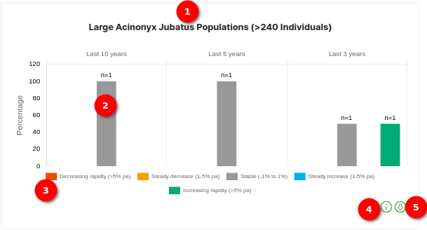

1. **Chart Title**: The chart title displays the title of the chart with the selected species scientific name and range of individuals.

2. **Bars**: These bars visually depict the distribution of percentage. The hover feature displays the percentage range calculated over specified time intervals, such as the last 10 years, last 5 years, and last 3 years. This information allows users to evaluate and understand the population trends for large species over different temporal scopes, providing a dynamic perspective on their changes and variations.

    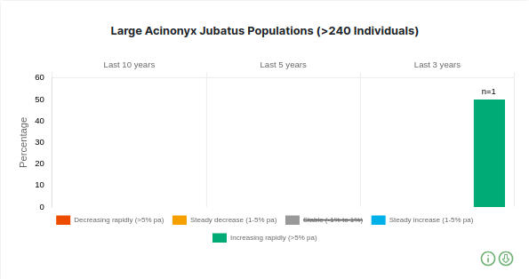

3. **Tooltip**: The tooltip feature provides additional details about each data point on the chart. It specifically shows the conditions, percentage, along with corresponding colors. Users can interact with the chart by clicking on the condition in the Tooltip, enabling them to selectively remove bars from the chart. This interactive functionality allows users to focus on and explore specific condition of their choice within the chart.

4. **Information Icon**: Hover over the information icon to access details about the chart.

5. **Download Icon**: Click the download icon to save the currently displayed chart.

    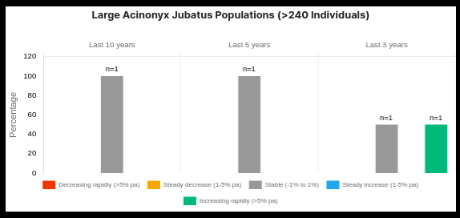

### Total area vs area available to species

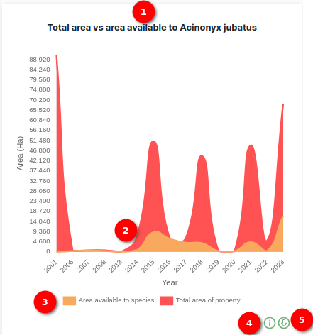

1. **Chart Title**: The chart title displays the title of the chart with selected species scientific name.

2. **Lines**: The lines in this chart provide a visual representation of the distribution of area available to species in comparison to the total area of the property. Each line is distinctly coloured, adding a visual element to differentiate between various data series.

3. **Tooltip**: The tooltip is designed to provide detailed information for each data point on the line chart. It specifically displays the comparison between the area available to species and the total area of the property. Users can interact with the chart by clicking on a specific area value in the tooltip. This interactive functionality allows users to selectively remove lines from the chart, enabling them to focus on and explore specific areas of interest within the context of the area available to species versus the total property area. The corresponding colors in the tooltip enhance visual association, aiding users in comprehending the data distribution on the line chart.

    

4. **Information Icon**: Hover over the information icon to access details about the chart.

5. **Download Icon**: Click the download icon to save the currently displayed chart.

    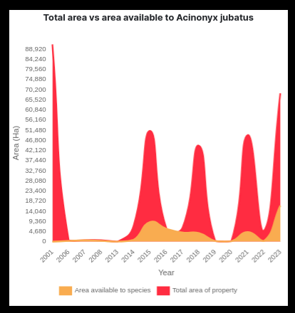

### Medium Species Populations

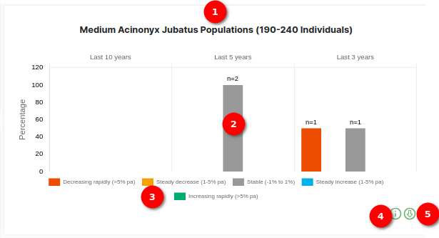

1. **Chart Title**: The chart title provides a clear identification of the chart, focusing on trends related to medium species populations with the selected species scientific name and range of individuals.

2. **Bars**: These bars visually represent the distribution of percentage for medium species populations. The hover feature presents the percentage range calculated over specific time intervals, such as the last 10 years, last 5 years, and last 3 years. This functionality enables users to assess and comprehend the population trends for medium species over different temporal scopes, offering a dynamic perspective on their changes and variations.

    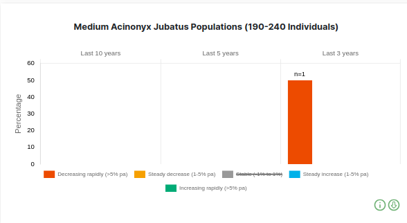

3. **Tooltip**: The tooltip feature in this context provides additional insights into each data point on the chart. It specifically displays information about the conditions, percentage, and corresponding colors related to medium species populations. Users can interact with the chart by clicking on a condition in the tooltip, allowing them to selectively remove bars and focus on exploring specific conditions of their choice within the chart.

4. **Information Icon**: Hover over the information icon to access details about the chart.

5. **Download Icon**: Click the download icon to save the currently displayed chart.

    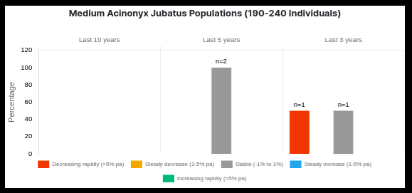

### Small Species Populations

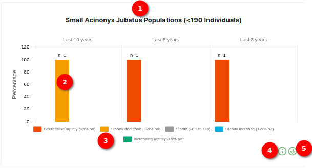

1. **Chart Title**: The chart title provides a clear identification of the chart, emphasising trends related to small species populations with the selected species scientific name and range of individuals.

2. **Bars**: These bars visually depict the distribution of percentage for small species populations. The hover feature reveals the percentage range calculated over specific time intervals, including the last 10 years, last 5 years, and last 3 years. Users can utilise this feature to assess and comprehend the population trends for small species across different temporal scopes, gaining a dynamic perspective on their changes and variations.

    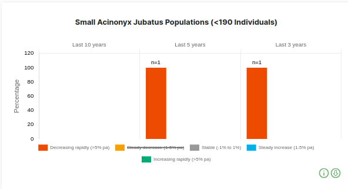

3. **Tooltip**: The tooltip feature offers additional insights into each data point on the chart. It specifically showcases information about conditions, percentage, and corresponding colors related to small species populations. Users can interact with the chart by clicking on a condition in the tooltip, facilitating the selective removal of bars and enabling a focused exploration of specific conditions within the chart.

4. **Information Icon**: Hover over the information icon to access details about the chart.

5. **Download Icon**: Click the download icon to save the currently displayed chart.

    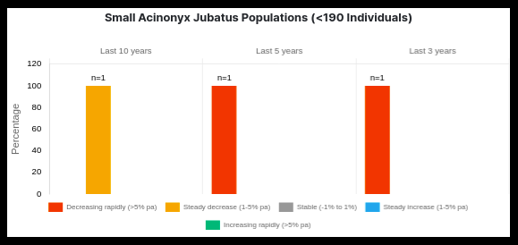

## Provincial Level Trends

Delving deeper, the Province Level Population Trends offer a regional breakdown of demographic patterns. Users can examine the population trends specific to each province.

### Province Population Trend Charts

- **Trends Charts for Provinces**: Multiple charts are available, each representing the population trends for a specific province over the years.

- **Population Over the Years**: The charts allow users to easily track and analyse population trends at the province level over time. Each chart provides a visual representation of how the population dynamics fluctuate across the specified years, offering insights into patterns and variations unique to each province.

- **Year**: The X-axis indicates the years, providing a chronological reference for the population trends observed in each province.

- **Information Icon**: Hover over the information icon to access additional details about the trends chart, providing users with relevant context and insights.

- **Download Icon**: Each chart comes with a download icon, allowing users to save the currently displayed province-level population trends chart for further analysis or documentation.

### Province Population Percentage Charts

- **Chart Title**: Each chart title displays the title of the chart along with the specific province name.

- **Bars**: These bars visually represent the distribution of percentage for province population. The hover feature displays the percentage range calculated over specified time intervals, such as the last 10 years, last 5 years, and last 3 years. This functionality allows users to assess and comprehend the population trends for each province over different temporal scopes, providing a dynamic perspective on their changes and variations.

- **Tooltip**: The tooltip feature, consistent across all charts, provides additional details about each data point. It specifically shows information about conditions, percentage, and corresponding colors. Users can interact with the chart by clicking on a condition in the tooltip, enabling them to selectively remove bars from each province's population percentage chart. This interactive functionality allows users to focus on and explore specific conditions of their choice within each chart.

- **Information Icon**: Hovering over the information icon provides users with additional details about the specific province's population percentage chart.

- **Download Icon**: Each chart comes equipped with a download icon, allowing users to save the currently displayed province population percentage chart for further analysis or documentation.

All the charts in this set share the same user-friendly functionality, providing a consistent and comprehensive exploration of province population percentage trends. Users can easily compare and analyse the demographic dynamics of different provinces over various time intervals.

### Property Population Trend Charts

- **Trends Charts for Properties**: Multiple charts are available, each representing the population trends for properties at a specific level over the years.

- **Population Over the Years**: These charts enable users to track and analyse population trends at the property level over time. Each chart offers a visual representation of how population dynamics fluctuate across the specified years, providing insights into patterns and variations unique to each property level.

- **Year**: The X-axis indicates the years, providing a chronological reference for the population trends observed in each property level.

- **Information Icon**: Hover over the information icon to access additional details about the trends chart, offering users relevant context and insights into property level trends.

- **Download Icon**: Each chart is equipped with a download icon, enabling users to save the currently displayed property-level population trends chart for further analysis or documentation.

These charts facilitate a detailed exploration of population trends at different property levels, empowering users to understand and compare demographic dynamics across various segments.
