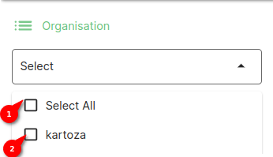
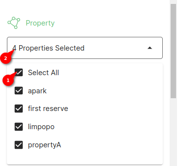

# Filter Side Panel Documentation

## Description
The filter side panel allows users to refine and narrow down data based on specific criteria. There are different type of filters are available for customization.
The filter side panel enhances the user experience by allowing them to focus on specific subsets of data based on their preferences, making it easier to analyse and work with the dataset effectively.
## Filter

1. **Explore**:Open the explore page by clicking on the `Explore` on navbar.
2. **Filter**: Open the filter side panel by clicking on the `Filter` option. Inside the side panel, you will find the all the filters. For each filter, interact with the available options or input fields to customize your filter criteria. Just click on the dropdown and select the filter.

## Filter side panel

## Filter Types

### 1. Organisation Filter
- **Filter Description:** This filter allows users to filter data according to the organization.
- **Usage:** Select an organization from the dropdown menu to filter data specific to that organization.

    ## Organisation filter
    

    1. **Selecting All Organisations**:To view data from all organizations, simply check the "Select All" option within the Organisation Filter.

    2. **Selecting Individual Organisations**:To filter data for specific organizations, follow these steps:
    Uncheck the "Select All" option if it is selected.
    A list of available organizations will be displayed.
    Check the checkboxes next to the organizations you want to include in the filter.

### 2. Report Type Filter
- **Filter Description:** This filter enables users to filter data based on report types.
- **Usage:** Choose a report type from the list to view data associated with that report type.

    ## Report filter
    

    1. **Report type**:The Report Type Filter is a single-select filter that allows users to filter data based on specific report types. With this filter, you can easily narrow down your dataset to view data associated with a particular report type.

### 3. Property Filter
- **Filter Description:** The property filter helps users filter data based on properties.
- **Usage:** Select a property from the available options to view data related to that property.

    ## Property filter
    

    1. **Select all**:Select all selects all the properties.

    2. **Show selected property count**:You will see the count of the property selected.

### 4. Species Filter
- **Filter Description:** The species filter allows users to filter data by species.
- **Usage:** Choose a species from the list to view data specific to that species.

    ## Species filter
    

    1. **Searching for Species**: Click on the Species Filter dropdown. You will see a list of available species. Start typing the name of the species you are looking for in the search box provided. As you type, the list will dynamically filter to display matching species. Select the species you want to filter by from the list.

    2. **Single-Select Functionality**: The Species Filter allows you to select only one species at a time. If you select a different species, the filter will replace the previous selection with the newly chosen species.

### 5. Year Range Filter
- **Filter Description:** This filter allows users to narrow down data based on a specified year range.
- **Usage:** Set a range of years to view data within that timeframe. For example, selecting a range of "2010-2020" will display data recorded between 2010 and 2020.

    ## Year filter
    

    1. **Year range bar**: This is the bar which is used for settign the year range.

    2. **From**: Input field for the from (starting)year value.

    3. **To**: Input field for the to (ending)year value.

### 6. Spatial Filter
- **Filter Description:** This filter allows users to filter data based on spatial information.
- **Usage:** Specify spatial criteria to view data located within a specific geographical area.

    ## Spatial filter
    

    1. **Activity dropdown**: Using this you can filter the data according to the activity types.
    2. **Biome type dropdown**:Using this you can filter the data according to the biome types.
    3. **Critical biodiversity type dropdown**:Using this you can filter the data according to the critical biodiversity areas.
    4. **Protected area dropdown**:Using this you can filter the data according to the protected area types.
    5. **Population category dropdown**:Using this you can filter the data according to the population category types.
