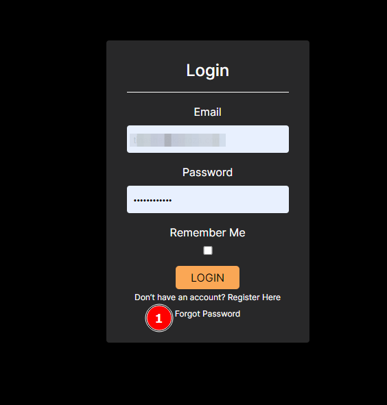
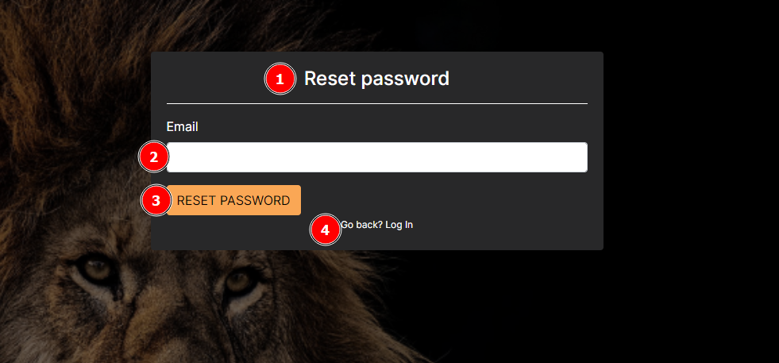
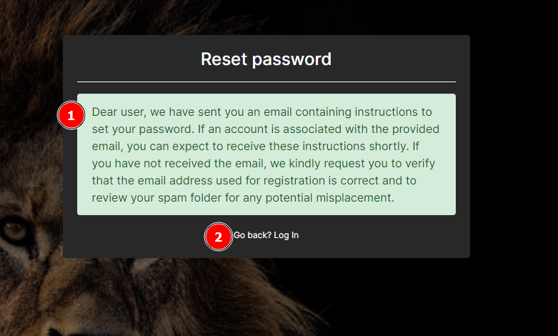
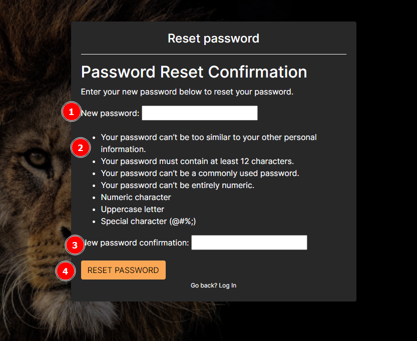

# Forgot Password Feature
<!-- These are instructions the user should take when they wish to reset their password -->

## Description

When the user has forgotten their password, they can use this feature to reset it.
The steps involve:

* Providing the correct email for the user account.
* Clicking on the reset password link provided in their email.
* Resetting their password on the platform.
* Logging in with their new password.

## Forgot password

1. **Forgot Password Link**: When clicked navigates the password reset page.

### Reset password

1. Reset Password Label
2. Email Field: the user should enter their email address into this field.
3. Reset Password button: when clicked sends the reset password email and notifies the user.

1. The message: contains instructions the user should follow in order to be able to reset their password.
2. Go back link: when clicked returns the user to the login page.

### Password reset email

* Email: has further instructions on completing the reset password process.
* Register button: When the user clicks the register link, they will be redirected to the platform to complete resetting their password.

### Password reset confirmation

1. New Password field: the user should enter their new password into this field.
2. Allowable Password characteristics: the new password for the user should include the characteristics described.
3. New password confirmation field: the user should re enter their password to make sure they didn’t make a mistake.
4. Reset password button: when clicked sets the password the user provided as the new password for logging in and also shows a success message.

### Password reset success

* Password reset success: the user receives a success message when the reset is completed without any errors.
