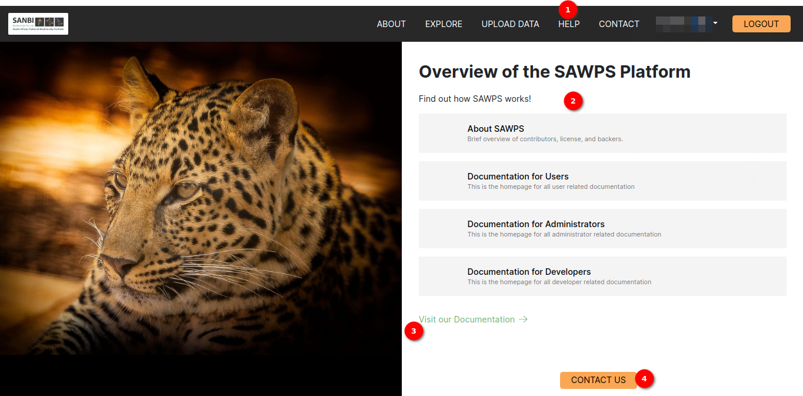
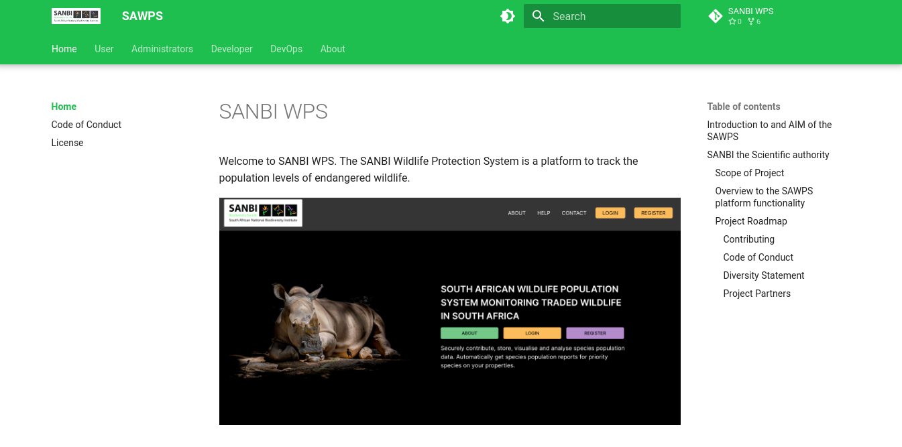
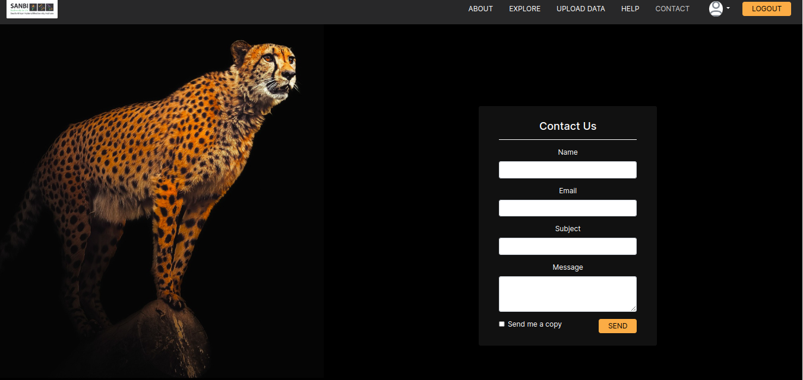

# Help and Contact
<!-- To Be Populated -->

## Description

The Help and Contact pages are valuable resources designed to assist users in navigating and understanding the application. This documentation explains the available features on the two pages.

### Help page overview

1. **The `HELP` Button:** Locate the `HELP` button within the application's user interface, typically found in the navigation menu, this will redirect a user to the Help Page.
2. **Help Text:** After navigating to the Help Page, there will be a brief text description about the platform.
3. **The `GO TO USER GUIDE` Button:** Redirects a user to the User Guide documentation site.
4. **The `CONTACT US` Button:** Redirects a user to the Contact Us page.

#### Go to user guide

The User Guide is a valuable resource for users seeking in-depth guidance.

1. The User Guide will open in a new browser tab.
2. A user can browse through the User Guide to find specific information or guidance on various topics related to the platform.

## Contact Page

### Description

The Contact Page serves as a means for users to get in touch with your organization or platform. Users can use this page to send messages, inquiries, or feedback. This documentation provides an overview of the fields and features available on the Contact Page.

### Contact Form

The Contact Page features a user-friendly contact form where users can provide their information and message. Here are the key components of the contact form:

1. **Name**: Users are required to enter their name in this field. It's where they should input their full name or a name by which they want to be addressed.

2. **Email**: This field is for users to provide their email address. It's important for the platform to have a way to reach out to users, so this is a required field.

3. **Subject**: Users can specify the subject or topic of their message in this field. It helps categorize and route messages appropriately.

4. **Message**: Users can compose their message or inquiry in this text box. It's where they can provide detailed information or ask questions.

5. **Send me a copy (Checkbox)**: Users have the option to check this box if they want to receive a copy of the message they are sending to their own email address. This can be useful for reference.

6. **Send Button**: After filling in the required information and composing their message, users can click the `SEND` button to submit their message. This initiates the process of sending the message to the organization.

## Summary

The Contact Page offers a straightforward and user-friendly contact form for users to get in touch. Users can provide their name, email, specify the subject, and compose their message. Additionally, there's an option to request a copy of the message they're sending. The `SEND` button is used to send the message to the platform. This page is an essential communication channel for users to connect with our organization.
