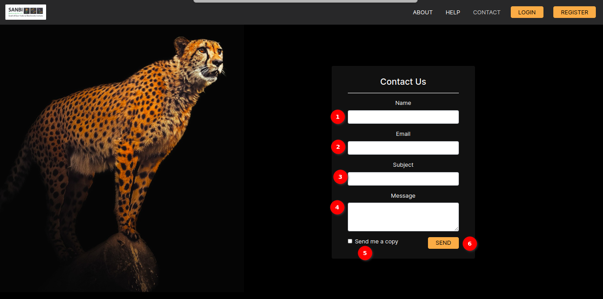

# Help and Contact
<!-- To Be Populated -->

The Help and Contact pages are valuable resources designed to assist users in navigating and understanding the application. This documentation explains the available features on the two pages.

## Help page overview

1. **The Help Button:** Locate the `HELP` button within the application's user interface, typically found in the navigation menu, this will redirect the user to the Help Page.

2. **Available Document links**:  These documentation links serve as valuable resources, providing users with comprehensive information and guidance on navigating and utilising various aspects of the site. Whether users are seeking assistance with specific features or gaining a deeper understanding of the platform's capabilities, the available documentation links offer a convenient pathway to enhance their overall experience and proficiency while interacting with the site.

3. **Visit Our Documentation**: To enhance your experience and maximise the utility of our platform, we encourage you to explore our comprehensive documentation. "Visit Our Documentation" provides a gateway to a wealth of resources aimed at guiding users through the site's features and functionalities. Whether you are a new user seeking a step-by-step guide or an experienced user looking for advanced tips and tricks, our documentation is tailored to cater to a diverse range of needs. Dive into detailed tutorials, troubleshooting guides, and informative articles to make the most out of your interaction with our platform. We believe that by visiting our documentation, you'll unlock the full potential of the site and discover efficient ways to achieve your goals.

    

4. **Contact Us**: Connect with SANBI through the dedicated contact page by clicking on the `Contact Us` button. SANBI welcomes user's inquiries and looks forward to assisting users.

## Contact Page

The Contact Page serves as a means for users to get in touch with different organisations or platforms. Users can use this page to send messages, inquiries, or feedback. This documentation provides an overview of the fields and features available on the Contact Page.

### Contact Form

The Contact Page features a user-friendly contact form where users can provide their information and messages. The key components of the contact form are:

1. **Name**: Users are required to enter their name in this field.  It is where they should input their full name or a name by which they want to be addressed.

2. **Email**: This field is for users to provide their email address. It is important for the platform needs to have a way to reach out to users, so this is a required field.

3. **Subject**: Users can specify the subject or topic of their message in this field. It helps categorise and route messages appropriately.

4. **Message**: Users can compose their message or inquiry in this text box.  It is where they can provide detailed information or ask questions.

5. **Send me a copy (Checkbox)**: Users have the option to check this box if they want to receive a copy of the message they are sending to their own email address. This can be useful for reference.

6. **Send Button**: After filling in the required information and composing their message, users can click the `SEND` button to submit their message. This initiates the process of sending the message to the organisation.

## Summary

The Contact Page offers a straightforward and user-friendly contact form for users to get in touch. Users can provide their name, email address, specify the subject, and compose their message. Additionally, there is an option to request a copy of the message they are sending. The `SEND` button is used to send the message to the platform. This page is an essential communication channel for users to connect with the organisation.
