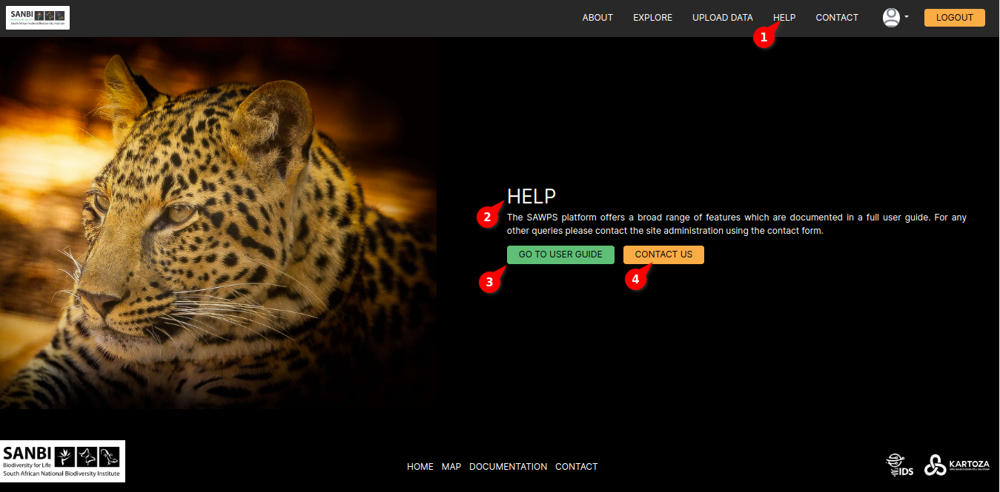
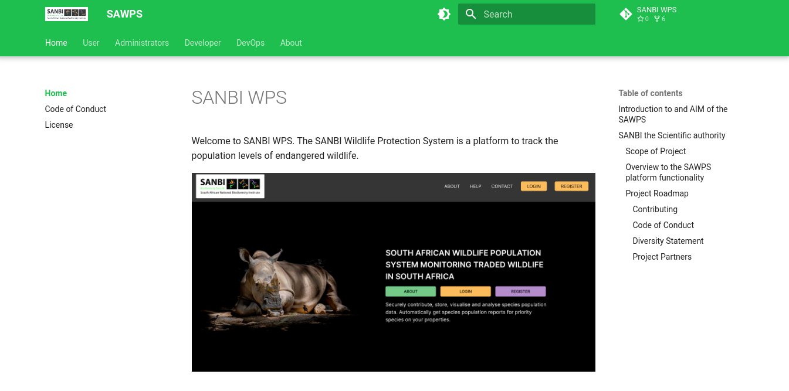
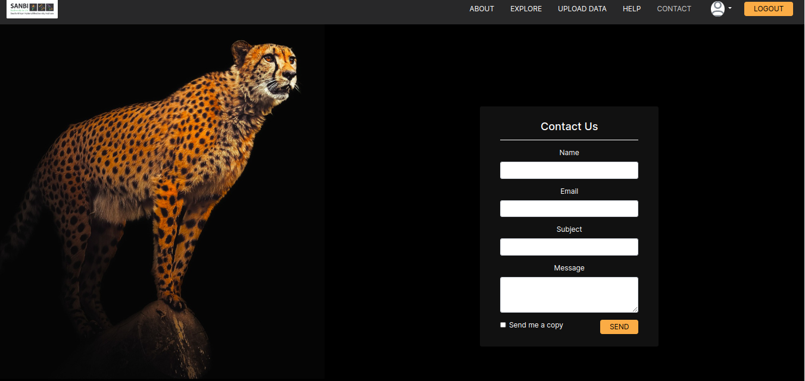

# Help Page Documentation

## Description

The Help Page is a valuable resource designed to assist users in navigating and understanding our application. This documentation provides step-by-step instructions on how to access the Help Page and explains the available features.

## Help page

## Accessing the Help Page

To access the Help Page, follow these simple steps:

1. **Click on the "HELP" Button**: Locate the "HELP" button within the application's user interface, typically found in the navigation menu.

2. **Help Text**: Upon opening the Help Page, you will find helpful text and guidance that provides information about using our application effectively.

## Navigation

The Help Page offers two primary navigation options:

### 3. Go to user guide

The "Go to User Guide" button provides access to a comprehensive User Guide, which contains detailed information about the application's features, settings, and functionalities. The User Guide is a valuable resource for users seeking in-depth guidance.

To utilize the "Go to User Guide" feature:

1. Click on the "Go to User Guide" button.

2. The User Guide will open in a new browser tab.

3. You can browse through the User Guide to find specific information or guidance on various topics related to the application.

## GO TO USER GUIDE

### 4. Contact Us

If you encounter any issues, have questions, or require additional assistance that is not covered in the Help Text or User Guide, you can easily reach out to our support team by using the "Contact Us" button.

To contact us:

1. Click on the "Contact Us" button.

2. You will be presented with a contact form or contact details, allowing you to initiate communication with our support team.

## CONTACT US

We are here to assist you and ensure that your experience with our application is as smooth and productive as possible. Feel free to explore the Help Page, User Guide, and contact us whenever you need assistance.
