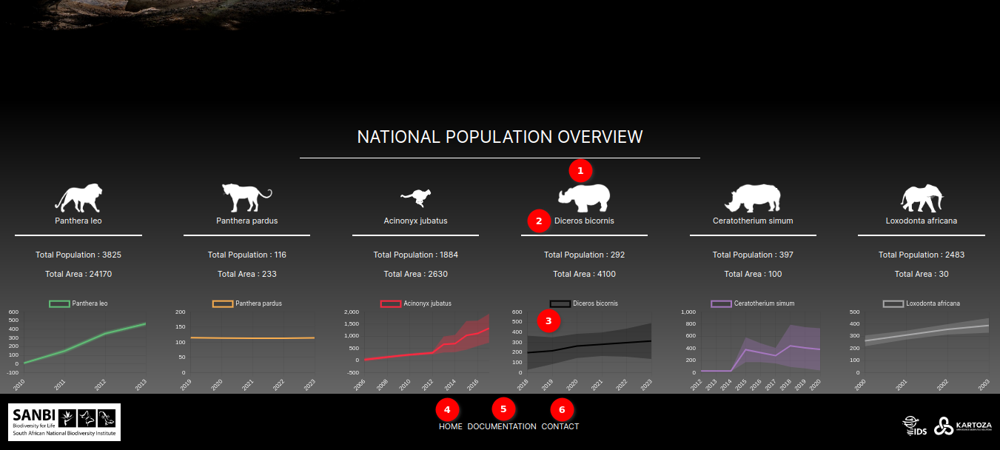

# Landing Page Documentation Before Login

## Description

Welcome to our `Landing Page`, the entry point to your data exploration journey. Our `Landing Page` provides a user-friendly interface for accessing and managing your data. Whether you're here to log in, create a new account, or learn more about our platform, this page offers easy access to all these features.

### Landing Page

In the navigation bar at the top of the page, you'll find several options:

1. **About**: Click the `ABOUT` button to learn more about our platform, its features, and its mission.

2. **Help**: The `HELP` button provides access to our comprehensive help and support resources. Whether you have questions or need assistance, you'll find valuable information here.

3. **Contact**: If you need to get in touch with us, simply click the `CONTACT` button. Our team is ready to assist you with any inquiries or issues you may have.

4. **Login**: To access your account, click the `LOGIN` button. If you're already a registered user, you can log in here.

5. **Register**: If you're new to our platform, you can click `REGISTER` to create a new account. Registration is quick and easy, and it will give you full access of platform.

## Central Buttons

In the middle of the landing page, you'll find three prominent buttons:

6. **About**: Click `ABOUT` to access detailed information about our platform, its features, and how it can benefit you. Learn more about what we offer and why our data solutions are invaluable.

7. **Login**: If you already have an account with us, clicking `LOGIN` will take you to the login page where you can securely access your data.

8. **Register**: If you're new to our platform, click `REGISTER` to begin the registration process. Becoming a registered user opens up a world of data exploration and manipulation.

## National Population Trends

On our `Landing Page`, you'll find an interactive chart that displays national population trends. This chart provides valuable insights into demographic changes and trends over time.
### National Population Trends

1. **Image**: Image of the species.

2. **Scientific Name**: Scientific name of the species.

3. **Chart**: Chart showing the data of the species over the year.

## Footer Buttons

In the footer of the `Landing Page`, you'll find four buttons for easy navigation:

4. **HOME**: Click `HOME` to return to the main landing page and access the national population trends chart and other features.

5. **MAP**: The `MAP` will redirect you to the login page because login is requred to see the `map` data.

6. **DOCUMENTATION**: Click `DOCUMENTATION` you'll redirect to the landing page.

7. **CONTACT**: If you have any questions, require assistance, or wish to provide feedback, clicking `CONTACT` will allow you to get in touch with our support team.

# Landing Page Documentation After Login

### Landing Page

## Navigation Bar

The navigation bar at the top of the `Landing Page` offers convenient access to key sections and actions within our platform. It includes the following elements:

1. **About:** Click the `ABOUT` link to learn more about our platform, its mission, and the team behind it.

2. **Explore:** The `EXPLORE` link takes you to the explore page, where you can delve into your datasets and perform in-depth analysis.

3. **Upload Data:** Use the `UPLOAD DATA` link to add new datasets to your account, expanding your data resources.

4. **Help:** Click on `HELP` for assistance and guidance on using our platform effectively.

5. **Contact:** If you have questions or need support, select the `CONTACT` option to reach out to our dedicated support team.

6. **My Profile:** Access your user profile by clicking on `MY PROFILE.` Here, you can customize your settings and view your user information, including your profile image.

7. **Logout:** The `LOGOUT` button allows you to securely log out of your account when you're done using our platform.

## Main Content

In the central part of the `Landing Page`, you'll find three prominent buttons that guide you to key areas of our platform:

8. **About:** The `ABOUT` button here serves as a quick link to the detailed information about our platform and its objectives.

9. **Explore:** Clicking `EXPLORE` will take you directly to the explore page, where you can view, manipulate, and analyze your datasets with various tools and filters.

10. **Upload Data:** Select `UPLOAD DATA` to initiate the process of adding new datasets to your account, making them accessible for further analysis.

### National Population Trends

1. **Image**: Image of the species.

2. **Scientific Name**: Scientific name of the species.

3. **Chart**: Chart showing the data of the species over the year.
## Footer

The footer section, located at the bottom of the `Landing Page`, offers links to additional resources and pages:

4. **Home:** The `HOME` link returns you to the main `Landing Page`, providing an easy way to start your journey within our platform.

5. **Map:** By choosing `MAP,` you can access geographical data visualization and exploration features within our platform, also you can see the reports for the data.

6. **Documentation:** Click `DOCUMENTATION` to access comprehensive documentation, like this page, which provides detailed information on various aspects of our platform.

7. **Contact:** If you need to get in touch with us for any reason, the `CONTACT` link provides access to our support and communication channels.

## Summary

Our enhanced `Landing Page` is your starting point for data exploration and interaction. With easy access to national population trends, a user-friendly interface, and convenient navigation options, you can seamlessly embark on your data journey and explore demographic insights while enjoying comprehensive support.
