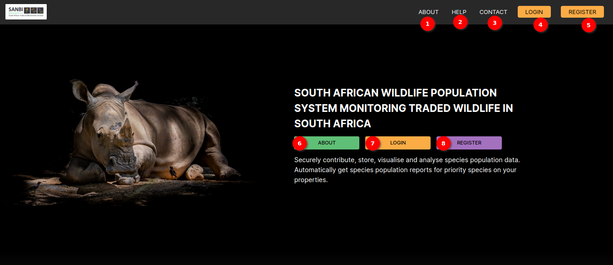
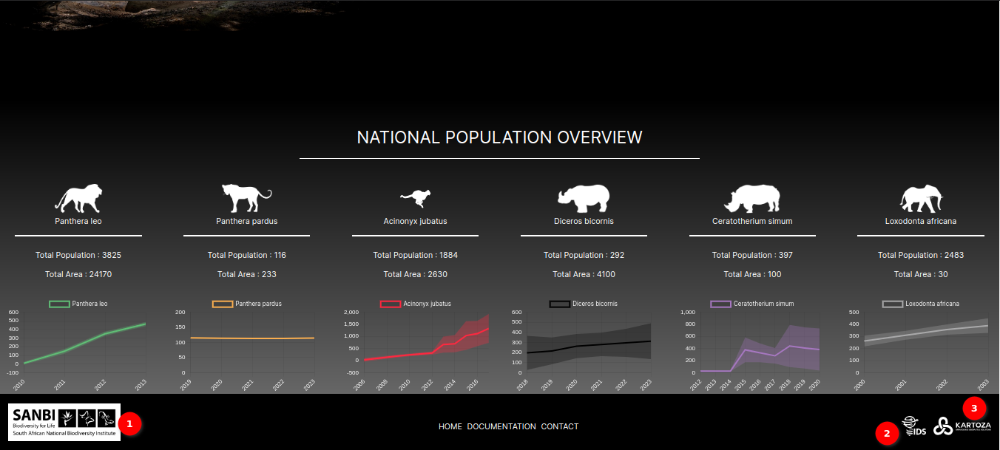
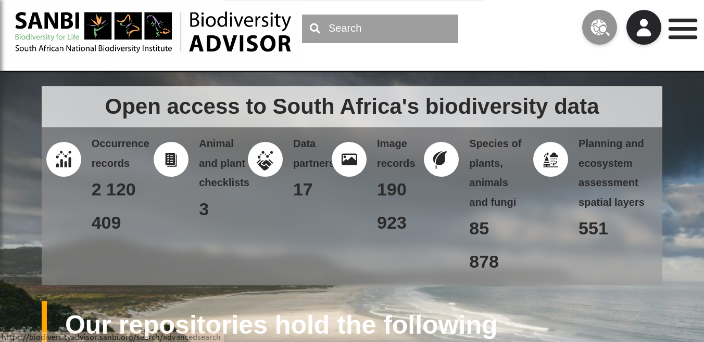

# Landing Page

Welcome to the SAWPS `Landing Page`. The landing page is the entry point to users' data exploration journey. The `Landing Page` provides a user-friendly interface to view aggregated species population data trends for South Africa and access features like log in, register a new account, or learn more about the platform.

## Prior to Login

Upon initial interaction with the platform, users will be greeted by the landing page.

### Landing Page Header and Navigation Bar

In the navigation bar at the top of the page, users will find several options:

1. **About**: The `ABOUT` navigation link navigates to the [about page](about.md).

2. **Help**: The `HELP` navigation link provides access to the [help page](help-contact.md) and support resources.

3. **Contact**:  The `CONTACT` navigation link navigates to the [contact page](help-contact.md) where the SAWPS team is ready to assist with any inquiries or issues.

4. **Login**: The `LOGIN` button opens the [login form](./login-logout/login-page.md) for registered users.
4. **Login**: The `LOGIN` button opens the [login form](./login-logout/login-page.md) for registered users.

5. **Register**: The `REGISTER` button opens the [registration form](./register/register-page.md) where users can register for access to the full platform.

6. **About**: The `ABOUT` button navigates to the [about page](about.md).

7. **Login**: The `LOGIN` button navigates to the [login form](./login-logout/login-page.md) where registered users can securely access the platform using their credentials.

8. **Register**: The `REGISTER` button navigates to the [registration form](./register/register-page.md) where new users can register on the platform. Becoming a registered user opens up a world of data contribution and exploration.
8. **Register**: The `REGISTER` button navigates to the [registration form](./register/register-page.md) where new users can register on the platform. Becoming a registered user opens up a world of data contribution and exploration.

### National Population Trends

On the `Landing Page`, users can view interactive charts that display national population trends. The charts provide valuable insights into demographic changes and trends over time.

1. **Icon**: Representative image of the species.

2. **Scientific Name**: Scientific name of the species.

3. **Chart**: Chart showing the population trend for the species over time.

4. **HOME**: The `HOME` link to return to the main [landing page](#prior-to-login).

5. **EXPLORE**: The `EXPLORE` link navigates the user to the explore page.

6. **DOCUMENTATION**: The `DOCUMENTATION` link navigates the user to the SAWPS documentation site in a new tab.

7. **CONTACT**: The `CONTACT` link navigates to the [contact page](./help-contact.md) where a user can use the contact form to ask any questions, or wish to provide feedback to the SAWPS support team.

### Additional Resources and Pages

The footer section, located at the bottom of the `Landing Page`, offers links to additional resources and pages:

1. **SANBI Logo**: By clicking on the `SANBI LOGO`, users will be redirected to the `SANBI (South African National Biodiversity Institute)` platform. The South African National Biodiversity Institute (SANBI) contributes to South Africa’s sustainable development by facilitating access to biodiversity data, generating information and knowledge, building capacity, providing policy advice, showcasing and conserving biodiversity in its national botanical and zoological gardens.

    **SANBI**

    

2. **IDS Logo**: By clicking on the `IDS LOGO`, users will be redirected to the `IDS (Information Decision Systems)` platform. Information Decision Systems (IDS) is a progressive Geographical Information Systems, Environmental Consulting and Disaster Management service provider.

    **IDS**

    

3. **KARTOZA Logo**: By clicking on the `KARTOZA LOGO`, users will be redirected to the `KARTOZA` platform. Kartoza is a South Africa-based Free and Open Source GIS service provider. Kartoza develop and maintain geographic information systems and train teams to use geospatial software to its full potential.

    **KARTOZA**

    

## Landing Page Once Logged In

Once the user has logged in to the SAWPS platform the landing page updates. In the header, there are new navigation links to features of the site that users with credentials have access to, their user profile, and the Quick links provide access to site features that users will need frequently.

### Navigation Bar

The navigation bar at the top of the `Landing Page` offers convenient access to key sections and actions within the SAWPS platform. It includes the following elements:

1. **About**: The `ABOUT` navigation link navigates to the [about page](about.md).

2. **Explore:** The `EXPLORE` link navigates to the [explore page](./explore/index.md), where users can delve into the data and perform analyses.

3. **Upload Data:** The `UPLOAD DATA` link navigates to the [upload data page](./data-upload/index.md), where the user can start the data upload process.

4. **Help:** The `HELP` link navigates to the [help system](./help-contact.md) and documentation built into the site.

5. **Contact:** The `CONTACT` link navigates to the [contact page](./help-contact.md) where users can reach out to the SAWPS support team.

6. **Profile Name and Icon:** Users can access their user [profile](./user-profile/index.md) by clicking on `MY PROFILE.` Here, users can customise their settings and view their user information, including their profile image.

7. **Logout:** The `LOGOUT` button allows users to securely [log out](./login-logout/logout.md) of their account when they are done using the platform.

8. **About:** The `ABOUT` button serves as a link to the [about page](./about.md) for the platform and its objectives.

9. **Explore:** Clicking `EXPLORE` will take users directly to the [explore page](./explore/index.md), where they can view, manipulate, and analyse their datasets with various tools and filters.

10. **Upload Data:** Clicking `UPLOAD DATA` will take users to the [data upload](./data-upload/index.md) process.

#### National Population Trends

1. **Image**: Image of the species.

2. **Scientific Name**: Scientific name of the species.

3. **Chart**: Chart showing the data of the species over the year.

4. **Home:** The `HOME` link returns users to the main [`Landing Page`](#landing-page-once-logged-in), providing an easy way to start their journey on the platform.

5. **EXPLORE**: The `EXPLORE` link navigates the user to the [explore page](./explore/index.md).

6. **Documentation:** Click `DOCUMENTATION` to access comprehensive documentation, like this page you are viewing, which provides detailed information on various aspects of the platform.

7. **Contact:** If users need to get in touch with the team for any reason, the `CONTACT` link provides access to the support and communication channels.

### Additional Resources and Pages

The footer section, located at the bottom of the `Landing Page`, offers links to additional resources and pages:

1. **SANBI Logo**: By clicking on the `SANBI LOGO`, users will navigate to the `SANBI (South African National Biodiversity Institute)` platform. The South African National Biodiversity Institute (SANBI) contributes to South Africa’s sustainable development by facilitating access to biodiversity data, generating information and knowledge, building capacity, providing policy advice, showcasing and conserving biodiversity in its national botanical and zoological gardens.

    **SANBI**

    

2. **IDS Logo**: By clicking on the `IDS LOGO`, users will navigate to the `IDS (Information Decision Systems)` platform. Information Decision Systems (IDS) is a progressive Geographical Information Systems, Environmental Consulting and Disaster Management service provider.

    **IDS**

    

3. **KARTOZA Logo**: By clicking on the `KARTOZA LOGO`, users will navigate to the `KARTOZA` platform. Kartoza is a South Africa-based Free and Open Source GIS service provider. Kartoza develop and maintain geographic information systems and train teams to use geospatial software to its full potential.

    **KARTOZA**

    

## Summary

The enhanced `Landing Page` is the starting point for data exploration and interaction. With easy access to national population trends, a user-friendly interface, and convenient navigation options, users can seamlessly embark on their data journey and explore demographic insights while enjoying comprehensive support.
