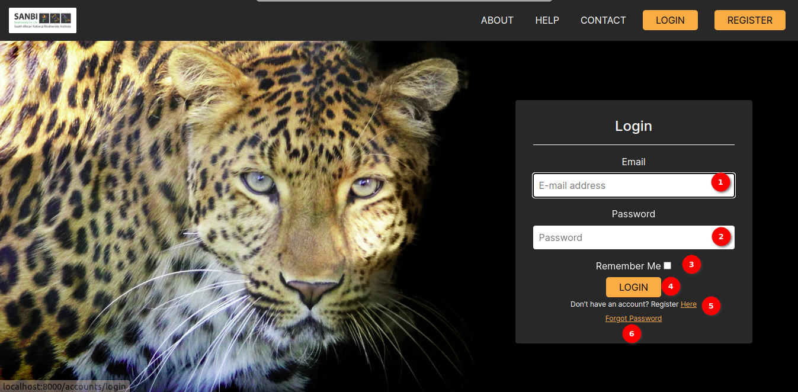

# Login Page Documentation

## Description

The Login Page is the entry point to access your account within the application. This page provides a secure way for users to log in using their credentials. It offers a straightforward interface for entering your email address, password, and includes an optional "Remember Me" checkbox for convenience.

## Login Form

1. **Email**: Enter your registered email address in this field. This is the email associated with your account.

2. **Password**: Input your password in this field. Passwords are case-sensitive, so ensure you enter it correctly.

3. **Remember Me**: Check this box if you want the application to remember your login credentials for future sessions. This feature is optional and can be useful for quick and convenient access.

4. **Login Button**: Click the `LOGIN` button to submit your credentials and access your account.

5. **Forgot Password**: The `Forgot Password` link opens the [forgot password](forgot-password.md) for reset password.
### Remember Me

The "Remember Me" checkbox allows you to opt for the application to remember your login information. When checked, you won't need to re-enter your email and password each time you visit the login page. This is particularly convenient for returning users who want a seamless login experience.

### Security

The `Login Page` is designed with security in mind to protect your account and sensitive information. It uses encryption protocols and best practices to ensure that your login credentials are kept secure.

### Logging In

Please ensure that you enter your email and password correctly to access your account. After clicking the `LOGIN` button, you will be redirected to the two factor authentication page within the application.

## Summary
The Login Page serves as the gateway to your account, providing a secure and user-friendly way to access the application's features and functionality.
