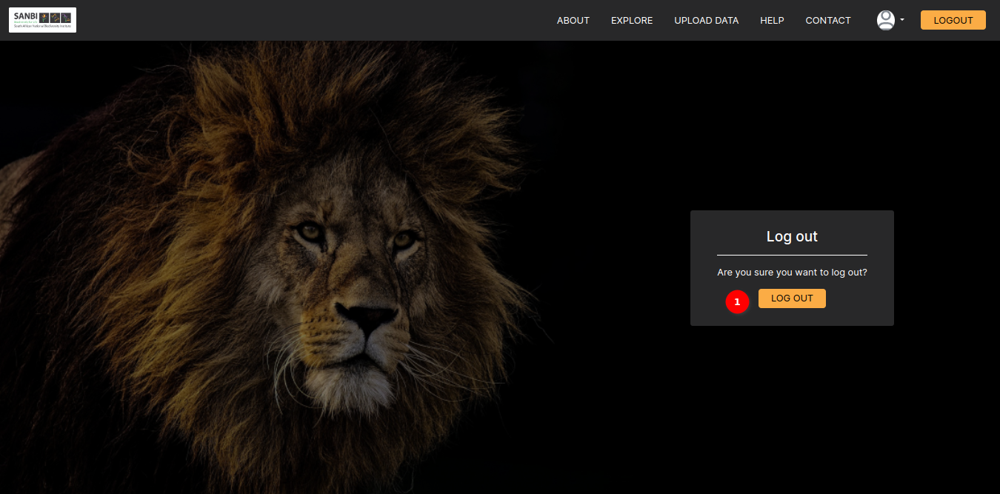

# Logout Page Documentation

The Logout Page is a secure and straightforward feature designed to allow users to log out of their account or session within the users application. This page provides a clean and intuitive interface for users to initiate the logout process, ensuring that their account remains protected and their session ends securely.

## Logout page

1. **Logout Button**: To log out of the current the user session, click the `LOG OUT` button. This action will terminate the users session, ensuring they are securely logged out of the application.

## Logout Process

When the user click the `LOG OUT` button, the following actions occur:

1. The system securely terminates the users current session.
2. User will be logged out of the users account, and any temporary data related to the users session will be cleared.
