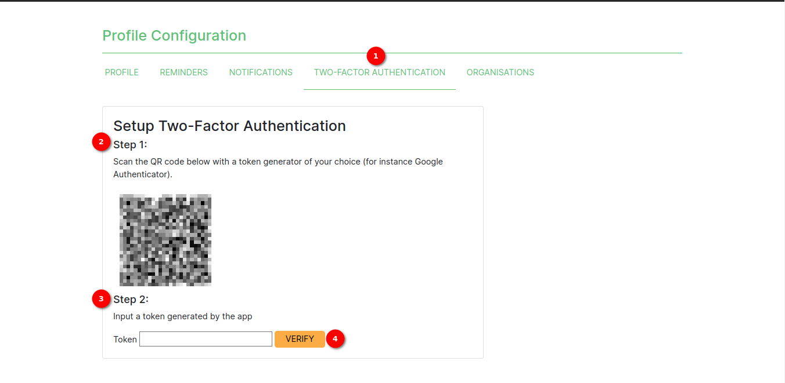
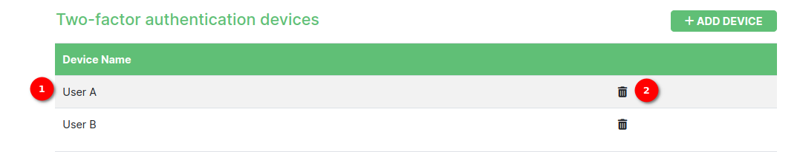
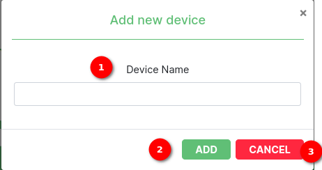

# Two-Factor Authentication (2FA) Setup Guide

## Introduction

Two-Factor Authentication (2FA) is an added layer of security designed to ensure that people trying to access an online platform. SAWPS values the security of user's account and data. This guide will walk you through the process of setting up 2FA for your SAWPS account.

## Prerequisites

Before begin setting up 2FA, make sure you have the following:

* A smartphone or tablet with a compatible authenticator app installed (e.g., Google Authenticator).

1. **Two-Factor Authentication**: User can generate and verify token on this page.

2. **Step 1**: Scan the QR Code

    * User will see a QR code displayed on the screen.
    * Open authenticator app on mobile device.
    * Tap the option to add a new account or scan a QR code.
    * Use device's camera to scan the QR code displayed on the screen.
    * The authenticator app will now generate one-time codes for SAWPS account.

3. **Step 2**: Input the Token

    * After scanning the QR code, user will see user's SAWPS account added to your authenticator app.
    * The app will continuously generate six-digit codes that change every 30 seconds.
    * To enable 2FA, user need to input a generated token from the app.
    * Input the current six-digit token generated by authenticator app into the input field named `Token`.

4. **VERIFY**: User can verify token using the `VERIFY` button. Upon successful verification, Two-Factor Authentication will be enabled for SAWPS account.

# Two-Factor Authentication (2FA) Once Verify

Once user will successfully verify the 2FA, user will able to add device, delete device and generate backop tokens.

1. **Two-factor authentication method**: Displays the mathod used for the 2FA.

2. **Two-factor authentication devices**: Two-factor authentication devices table displays names of devices and delete icon to delete the specific device.

    

    1. **Device Name**: Displays name of added devices.

    2. **Delete Icon**: User can delete the specific device by clicking on the delete icon.

3. **Add Device**: Button to add new device. By clicking on the `ADD DEVICE` button user will see the popup to add new device.

    

    1. **Device Name**: Input field to insert device name.

    2. **ADD**: Button to add new device.

        

        By clicking on the `ADD` button user will see popup for scaning the QR code. Scan QR code to generate token for new added device.

        1. **QR Code**: QR code to scan and generate token.

        2. **Close**: Button to close the popup.

    3. **Cancel**: Button to cancel adding new device process.

4. **Two-factor authentication recovery tokens**: Information text for token generation.

5. **Generate Backup Tokens**: By clicking on the `GENERATE BACKUP TOKENS` button user can generate tokens.

6. **Profile**: The `PROFILE` navigation link navigates to the [profile page](../user-profile/profile-page.md).

7. **Reminders**: The `REMINDERS` navigation link navigates to the [reminders page](../user-profile/reminders.md).

8. **Notifications**:  The `NOTIFICATIONS` navigation link navigates to the [notification page](../user-profile/notifications.md).

9. **Organisations**: The `ORGANISATIONS` navigation link navigates to the [organisation page](../user-profile/organisation-page.md) for registered users.

## Using Two-Factor Authentication

From now on, when user log in to SAWPS account, user will be prompted to enter the six-digit token generated by user's authenticator app in addition to user's regular login credentials. This extra layer of security will help protect user's account from unauthorized access.

## Conclusion

Congratulations! You have successfully set up Two-Factor Authentication (2FA) for your SAWPS account, enhancing the security of your data and account. If you encounter any issues during the setup process, please reach out to our support team for assistance.
