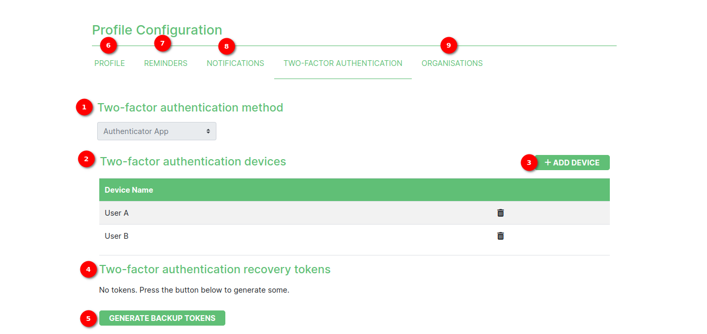

# Two-Factor Authentication (2FA) Setup Page

Two-factor authentication (2FA) is an added layer of security designed to ensure the security of people utilising the online platform. SAWPS values the security of the user's account and data. This page is an explanation of the various elements of the 2FA page users see when they register on the platform.

## Prerequisites
Before beginning to set up 2FA, users should ensure that they have the following:

* A smartphone or tablet with a compatible authenticator app installed (e.g., Google Authenticator).

1. **Two-Factor Authentication**: Users can generate and verify the token on this page.

2. **Step 1**: Users will see a QR code displayed on the screen that they can scan using their preferred authenticator application.
3. **Step 2**: The `Token` field is where users should type in the 6-digit token (generated by their authenticator application) that is associated with the account they are registering.
4. **VERIFY**: Users can verify the token using the `VERIFY` button. Upon successful verification, Two-Factor Authentication will be enabled for the SAWPS account and the user will be redirected to continue registering.

# Two-Factor Authentication (2FA) Once Verified

Once users have successfully verified the 2FA, they will be able to add devices, delete devices and generate backup tokens.

1. **Two-factor authentication method**: Displays the method used for the 2FA.

2. **Two-factor authentication devices**: The two-factor authentication devices table displays the names of devices and the delete icon to delete the specific device.

    

    1. **Device Name**: Displays the name of added devices.

    2. **Delete Icon**: Users can delete a specific device by clicking on the delete icon.

        By clicking on the delete icon users will see a popup for confirming the deletion of a device.

        

        1. The `CANCEL` button is used to cancel the device deletion.

        2. The `DELETE` button is used to delete the device.

3. Click on the `ADD DEVICE` button to add a new device. By clicking on the button users will see the popup to add new device.

    

    1. **Device Name**: Input field to add device name.

    2. *By clicking on the `ADD` button users will be shown a popup for scanning the QR code. Users can scan the QR code to generate a token for a newly added device.

        

        1. **QR Code**: to be scanned to generate a token.

        2. `CLOSE` button to close the popup.

    3. **Cancel**: `CANCEL` button to cancel the process of adding a new device.

4. **Two-factor authentication recovery tokens**: Information text for token generation.

5. **`GENERATE BACKUP TOKENS`**: By clicking on this button users can generate their recovery tokens.

6. The `PROFILE` navigation link navigates to the [profile page](../user-profile/profile-page.md).

7. The `REMINDERS` navigation link navigates to the [reminders page](../user-profile/reminders.md).

8. The `NOTIFICATIONS` navigation link navigates to the [notification page](../user-profile/notifications.md).

9. The `ORGANISATIONS` navigation link navigates to the [organisation page](../user-profile/organisation-page.md) for registered users.

## Using Two-Factor Authentication

When users log in to their SAWPS account, they will be prompted to enter the six-digit token generated by the user's authenticator application in addition to their regular login credentials. This extra layer of security will help protect the user's account from unauthorized access.

If users encounter any issues during the setup process, they should reach out to the support team for assistance.
