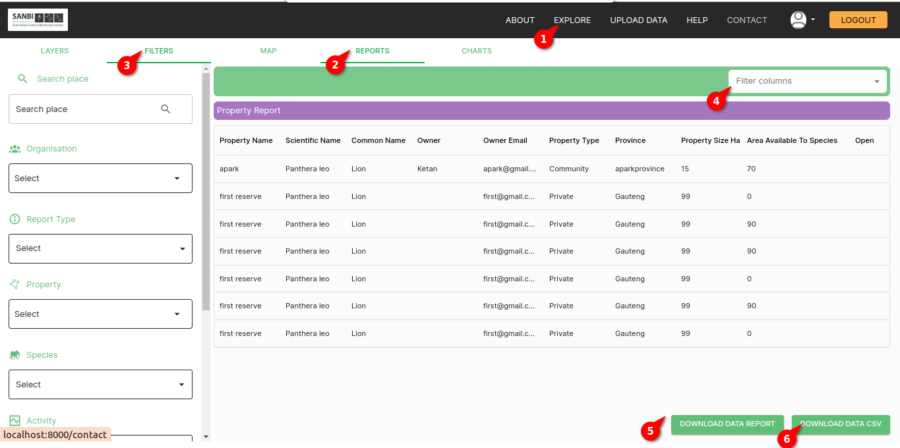

# Data Table Page Documentation

## Description
The Data Table Page is the central hub for viewing and interacting with your data. This page offers a user-friendly interface for exploring and manipulating your dataset. You can use a variety of features to customize your data view, including filters, column search, and data export options.

### Data Display
The main area of the page displays your dataset in a tabular format. Each row represents a record, and each column represents a data attribute.

## Data table

## Features and Functionality

1. **Explore**:Open the explore page by clicking on the `Explore` on navbar.
2. **Data**: Click on the `data` button to view the data.
3. **Filters**: Utilize the filters provided on the page to refine your data view. These filters include:
    - **Organisation Filter:** Filter data by organization.
    - **Report Type Filter:** Filter data by report type.
    - **Property Filter:** Filter data by property.
    - **Year Range Filter:** Filter data by a specified year range.
    - **Species Filter:** Filter data by species.
    - **Spatial Filter:** Filter data by spatial criteria.

    **Applying Filters:**
    - Click on the respective filter dropdowns.
    - Set your filter criteria.
    - Click on the filter to update the data display based on your filter selections.
- Each filter is designed to help you narrow down your dataset to view only the data that's relevant to your analysis.

4. **Column Search**: You can search for specific values within columns by selecting the column. This feature is especially useful when you need to locate specific data points within a large dataset. The table will dynamically filter to display selected column.

5. **XLSX Format:** Click the "DOWNLOAD DATA REPORT" button to download the current dataset in XLSX format.
6. **CSV Format:** Click the "DOWNLOAD DATA CSV" button to download the current dataset in CSV format.

## Summary
The Data Table Page is a comprehensive platform for exploring, analyzing, and interacting with your data. With filters, column search, and data export options, you have the tools necessary to customize your data view, find specific information, and export data in the format that suits your needs.
