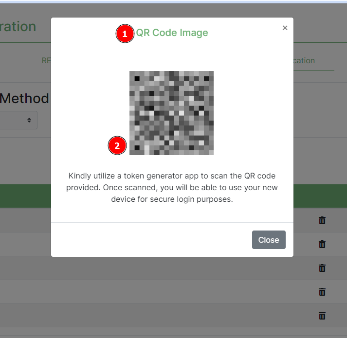

# Two Factor Authentication Settings

The Two factor authentication page handles the user’s two factor authentication settings.

These include:

* Backup tokens
* Two factor authentication devices

## Two Factor Authentication Tab

1. **Two Factor Authentication Tab** of the profile page, where a user will find the settings.
2. **Current 2FA Method**: This shows the current 2FA method the user uses to log on to the platform.
3. **Add Device**: Clicking this button will evoke a popup modal requiring the user to enter the new device details before saving.
4. **2FA Devices**: This is the table that shows the current 2FA devices the user uses to log on to the platform.
5. **Delete Icon**: Clicking this will evoke a popup modal prompting the user if they are sure they want to remove the device before proceeding to remove it.
6. **Recovery Options**: Under this header, is a list of the backup tokens the user can use to log on to the platform in case they have lost their device.
7. **Generate Backup Token**: The user can refresh their backup tokens as well as create new ones when they have just registered onto the platform.

### Add device popup modal

1. **Device Name**: Label indicating the value that is required in the field below it.
2. **Add button**: When clicked will save the new device and return a QR Code Image.

1. **QR Image Code**: Label indicating the success result when the device is added.
2. **QR Code**: The user should scan this QR code with the authenticator app of their choice on their new device.

### Delete device modal

1. **Cancel**: This will prevent the device from being removed. This is in case the user is not sure or clicked the icon by accident.
2. **Delete button**: will remove the device from the platform therefore the user will no longer be able to login using that device.
