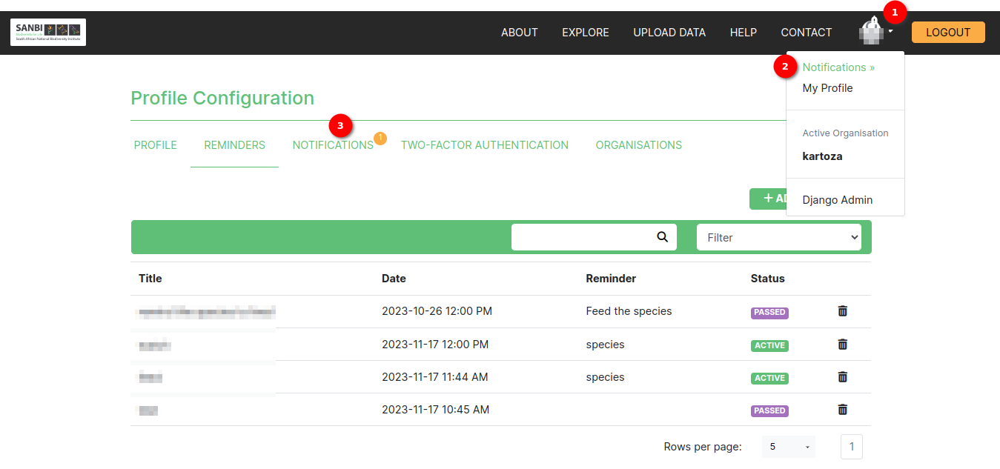

# Notifications Feature

* The notifications feature allows the user to receive push notifications of the reminders they have set via the platform.
* When a notification comes in, a small bell icon appears on the user profile icon.
* Also, a navigation link for notifications becomes available in the main navigation dropdown. This allows for the user to view the notifications from any page on the system.
* Clicking on the notification will lead the user to the notifications page where they can review more details about the notifications.
* On the profile pages, a small notification badge appears showing the number of notifications the user has.

1. When a notification comes in, a small bell icon appears on the user profile icon showing the number of notifications the user has.
2. A navigation link for notifications becomes available in the main navigation dropdown. This allows the user to view the notifications from any page on the system.
3. Clicking on a notification will lead the user to the notifications page where they can review more details about the notifications.

## Notifications tab

1. Navigation Link: Under the profile section a tab for notifications is available. When clicked renders the notifications page.
2. Search box: Allows the user to search for a specific notification. The search looks for keywords within the notification and the title columns.
3. Filter: The user can filter by title or notification. This refines the search to only return notifications containing the providing keywords specifically by the filter selected.
4. Notification: Clicking on any notification will cause the popup modal with notification information to appear.
5. Delete icon:
      * The user can delete their notifications.
      * Organisation Managers can delete organisation notifications.
      * When the delete icon is clicked a popup modal is evoked prompting if the user is sure of the actions they wish to take.

6. Rows per page: The user can choose the number of notifications they prefer to see on a page (The minimum is 5).
7. Pagination Link: The user can see the current page they are on. They are also able to navigate to previous and next pages using the navigation links.

### Notification information popup modal

### Delete notification popup modal

1. Delete Confirmation Title: Title pointing to what the modal is.
2. Delete Button: when clicked deletes the reminder.
