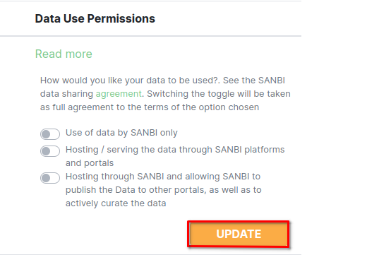

# Organisation page

1. **Dropdown**: Click on the dropdown to view the organisation options.

2. **Organisation Name**: Click on the name of the organisation to open organisation home page.

Every organisation can manage its organisation members via this page.

This page offers the following functionality:

* Viewing organisation members.
* Inviting new members to the organisation provided the user has the right permissions.
* Deleting organisation members provided the user has the right permissions.
* Searching to see if a member exists within an organisation.

## My Profile Organisation Tab

1. **My Profile**: Click on the My Profile link to access the profile configuration page.

1. **Organisations**: Click on the `ORGANISATIONS` tab to perform actions related to organisations.

2. **Active**: The `Active` button indicates the currently active organisation.

3. **Set Active**: Click on the `Set Active` button to designate the selected organisation as the current active organisation.

4. **Organisation Name**: Click on the name of the organisation to navigate to its home page.

    

5. **Read More**: Click on the Read More link to explore data use permissions. Users can adjust data use permissions by toggling the provided buttons.

    

6. **Pagination**: Click on the number to go to the preferred page.

    

    1. **Numbers**: Shows the page numbers.

## Profile Dropdown

1. **Dropdown**: Click on the dropdown to view the organisation options.

2. **Organisation Name**: Click on the name of the organisation to open organisation home page.

## Organisation home page

1. **Organisation name**: This is a heading that indicates to the user the current organisation they are viewing.
2. **Add people button**: When clicked will evoke a popup modal.
3. **Members title**: Shows what the section of the page contains
4. **Search box**: This allows the user to search for a specific member within the members table.
5. **Rows per page**: This allows the user to determine how many rows they prefer to see on a single page. This can help on smaller devices for example.
6. **Pagination**: Indicates the current page the user is on. As well as the nav links to manoeuvre to the previous or next page.
7. **Invitations Table Label**: This indicates to the user that the table below contains invites.
8. **Status**: The invitations table has a status role that shows whether the individual who has been invited has joined that organisation yet.

### Add people popup modal

1. **Email address field**: the user should provide the email address of the individual they wish to invite to the organisation.
2. **Invite as field**: the user should specify if the individual they’re inviting will have a manager or member role within the organisation.
3. **Invite button**: when clicked will send the invitation to the individual being invited to the organisation. A success message (example below) will show if the email has been sent.

### Email invitation

**Email Invitation Email**: The individual who is invited to the organisation will receive this email.

1. **Register button**: The individual being invited should click the register button, and they will be redirected to the website to complete their registration.

#### New member registration page

* **New member on platform**: If the individual is a new member on the platform, they will be taken through the normal registration and added to the organisation.
* **Member already registered on platform**: If the individual is not new on the platform they will just be registered on to the organisation they are being invited.
* **Registration Complete**: Once the registration is complete the individual invited will be able to log in and see their new organisation under accessible organisations.
