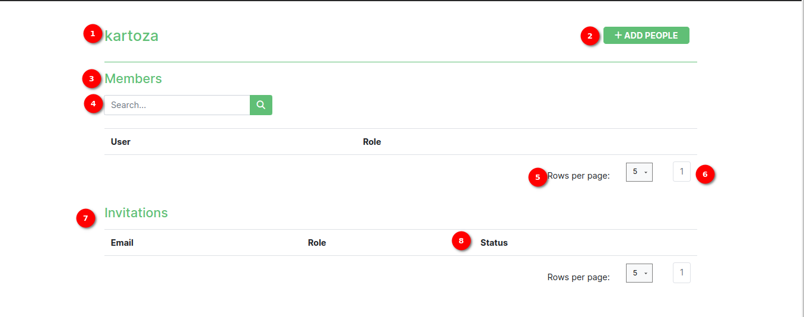

# Organisation page

## Description

Every organization can manage their organization members via this page.

This page offers the following functionality:

* Viewing organization members.
* Inviting new members to the organization provided the user has the right permissions.
* Deleting organization members provided the user has the right permissions.
* Searching to see if a member exists within an organization.

## Organisation home page

1. **Organization name**: This is a heading that indicates to the user the current organization they are viewing.
2. **Add people button**: When clicked will evoke a popup modal.
3. **Members title**: Shows what the section of the page contains
4. **Search box**: This allows the user to search for a specific member within the members table.
5. **Rows per page**: This allows the user to determine how many rows they prefer to see on a single page. This can help on smaller devices for example.
6. **Pagination**: Indicates the current page the user is on. As well as the nav links to manoeuvre to the previous or next page.
7. **Invitations Table Label**: This indicates to the user that the table below contains invites.
8. **Status**: The invitations table has a status role that shows whether the individual whom has been invited has joined that organization yet.

### Add people popup modal

1. **Email address field**: the user should provide the email address for the individual they wish to invite to the organization.
2. **Invite as field**: the user should specify if the individual they’re inviting will have a manager or member role within the organization.
3. **Permissions**: the user should specify the permissions the individual they’re inviting will have for the organization.
4. **Invite button**: when clicked will send the invitation to the individual being invited to the organization. A success message (example below) will show if the email has been sent.

### Email invitation

**Email Invitation Email**: the individual being invited to the organization will receive this email.

1. **Register button**: the individual being invited should click the register button, they will be redirected to the website to complete their registration.

#### New member registration page

* **New member on platform**: if the individual is a new member on the platform, they will be taken through the normal registration and added to the organisation.
* **Member already registered on platform**: if the individual is not new on the platform they will just be registered on to the organisation they're being invited.
* **Registration Complete**: Once the registration is complete the individual invited will be be able to login and see their new organisation under accessible organisations.
