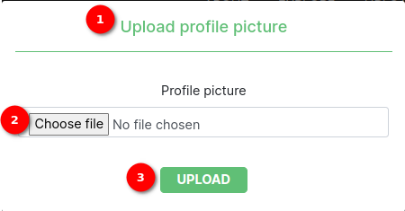

# SAWPS profile page

The Profile tab is the first tab on the profile configuration page. The page consists of the following components with the following functionality.

1. **The profile tab**: A tab that displays the user profile information
2. **Profile picture**: An area that displays the uploaded profile image
3. **Upload profile picture link**: Opens the upload profile picture popup (see profile picture popup)
4. **Update password button**: Opens the update password form for the user to make a new password for the platform (see update password form)
5. **First name field**: A text field for the user to add their first name which is saved to the database
6. **Last name field**: A text field for the user to add their last name which is saved to the database
7. **Title dropdown**: A drop-down for the user to select their title which is saved to the database
8. **Email address field**: A text field for the user to add their email address which is saved to the database
9. **Update button**: When clicked all changes made to the profile page field are saved to the database

## Profile picture popup

The profile picture popup appears when the Upload profile picture link is clicked in the profile tab of the profile configuration page.

1. **Popup title**: Shows what the popup is for
2. **Upload file button**: Goes to the system file browser for the user to select an image for the profile picture.
3. **Upload button**: Uploads the image to the platform associated with that user.

## Update password form

The update password form opens when the update password button is clicked on the profile tab in the profile configuration page.

1. **Current Password:** The field where the user must input their current password.
2. **New Password:** The field where the user must input their new password.
3. **Confirm New Password:** The field where the user must confirm their new password.
4. **`SAVE` Button:** The button that the user must click to save their updated password.
