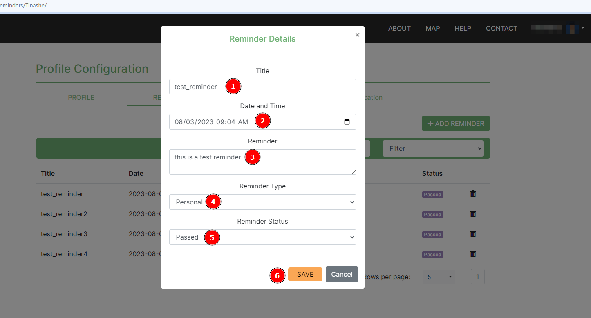

# Reminders Feature

## Description

The Reminders feature enables a user or organisation to do the following:

* Organisation: Set a reminder for everyone within the organisation.
* User: Set a personal reminder
* Edit a reminder: Changing its state from active, draft and passed or altering other details etc.
* Delete a reminder.
* The reminder set is sent via email and also the user is notified via the platform.

Other functionalities offered on the Reminders Page:

* Search for specific reminders.
* Search by filtering reminders.
* Pagination.
* Organisation: View all reminders set by different users who have the role to create reminders for all members of that specific organisation.
* User: View personal reminders.

## Reminders page

1. **Navigation Link**: Under the profile section a tab for reminders is available. When clicked renders the reminders page.
2. **Add Reminder**: When clicked will present the user with the form to fill for the reminder they intend to create.
3. **Search box**: Allows the user to search for a specific reminder. The search looks for keywords within the reminder and the title.
4. **Filter**: The user is able to filter by title or reminder. This refines the search to only return reminders containing the providing keywords specifically by the filter selected.
5. **Reminder**: Clicking on any reminder will cause the popup modal for editing the reminder to appear.
6. **Delete icon**:
      * The user can delete their reminders.
      * Organisation Managers can delete organisation reminders.
      * When the delete icon is clicked a popup modal is evoked prompting if the user is sure of the actions they wish to take.

7. **Rows per page**: The user is able to choose the number of reminders they prefer to see on a page (The minimum is 5).
8. **Pagination Link**: The user is able to see the current page they're own. They are also able to navigate to previous and next pages using the nav links.

### Add reminder form

1. **Title**: The user should provide the reminder title.
2. **Date and Time**: The user should schedule the reminder.
3. **Reminder**: The user should provide the description of the reminder.
4. **Reminder Type**: Based on the user role within that specific organisation the user is able to specify if the reminder is for all organisation members or it's a personal reminder.
5. **Add button**: When clicked creates the reminder.

### Reminder popup modal

1. **Title**: the user can change the reminder title.
2. **Date and Time**: the user can change scheduled time for the reminder.
3. **Reminder**: the user can change the description of the reminder.
4. **Reminder Type**: Based on the user role within that specific organisation the user is able to specify if the reminder is for all organisation members or if it's a personal reminder.
5. **Reminder Status**: the user is able to change the state of the reminder. If set to active the reminder is still scheduled, if set to draft the reminder is on pause, if set to passed the reminder will be moved to the notifications section but no email is sent.
6. **Save button**: when clicked saves the new edited details.

### Delete reminder popup modal

1. **Delete Confirmation Title**: Title pointing to what the modal is.
2. **Delete Button**: when clicked deletes the reminder.
