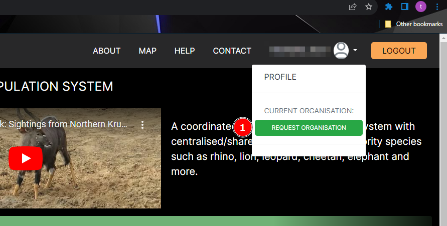
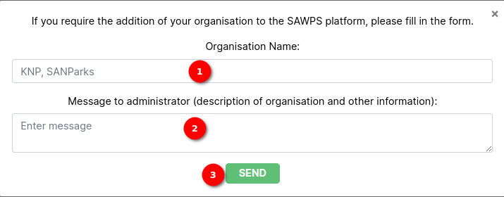
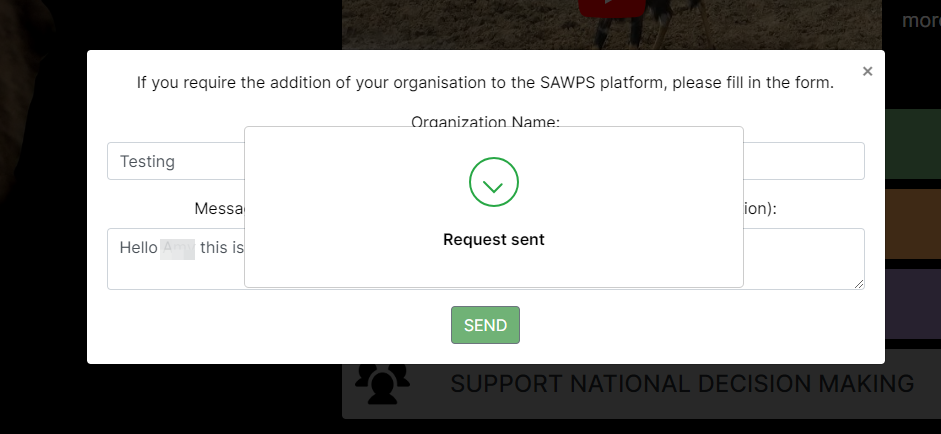

# Request organisation feature

## Description

* When a user on the platform wishes to have an organisation. They can request for one.
* The SANBI administrator will review the request and if they approve will create the organisation for the user and notify them via email.

## Request organisation link

1. **Request Organisation Link**:

    * This link is under the navigation dropdown next to the profile icon in the header.
    * The link is only visible to members without an organisation.
    * When the link is clicked a popup modal is evoked.

### Request organisation popup modal

1. **Organisation Name**: In this field the user should provide the name/s of the organisation they wish to have created.
2. **Message to Administrator**: The user requesting to have an organisation should provide a message providing a description of the organisation etc.
3. **Send button**: When the user clicks the send button, a confirmation (example below) will be returned to the user to let them know their invitation has been sent.

