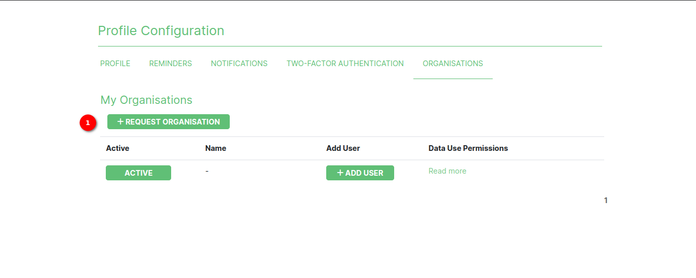

# Request organisation feature

* When a user on the platform wishes to have an organisation. They can request for one.
* The SANBI administrator will review the request and if they approve will create the organisation for the user and notify them via email.

1. **Request Organisation Button**:

    * The `REQUEST ORGANISATION` button is located in the `ORGANISATION` tab of the `My Profile` page.
    * This button is only visible to users who do not currently have an assigned organisation. If the user already has an organisation and would like to request another one, they can contact the SANBI team. Click [here](../help-contact.md) to get in touch with the SANBI team.
    * Clicking the Request Organisation button will evoke a popup modal for further actions.

### Request organisation popup modal

1. **Organisation Name**: In this field, the user should provide the name/s of the organisation they wish to have created.
2. **Message to Administrator**: The user requesting to have an organisation should provide a message providing a description of the organisation etc.
3. **Send button**: When the user clicks the send button, a confirmation (example below) will be returned to the user to let them know their invitation has been sent.

