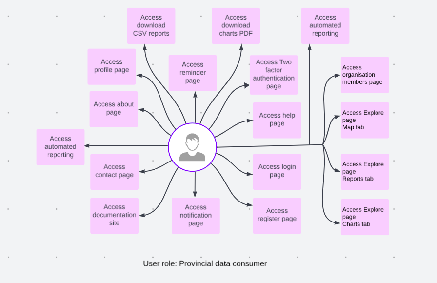
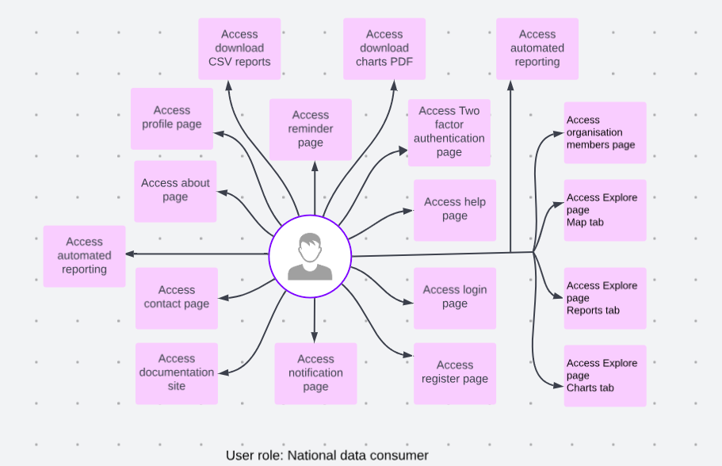
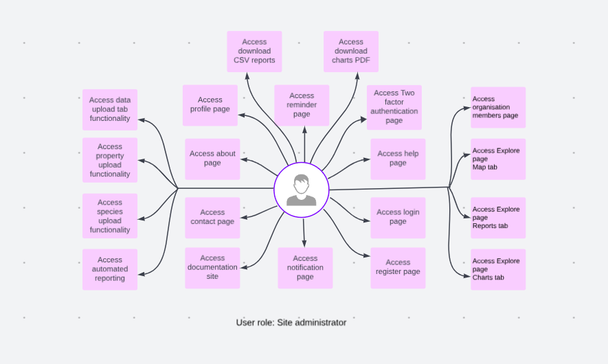

# User Roles Documentation

## User Roles

1. **Unnamed user**: A user on the internet who is not registered with the site.

    

    * **Full access**: The unnamed user has full access to login, register, about, contact, and help page. Unnamed users can access the documentation site.

2. **Floating user**: A registered user without an organisation who needs to request an addition to an organisation.

    

    * **Full access**: The floating user has full access to login, register, about, contact, profile, notification, reminders, two-factor authentication and help page. Floating users can access the documentation site.

3. **Organisation member**: A user who is registered on the site and part of an organisation.

    

    * **Full access**: The organisation member has full access to login, register, about, contact, profile, notification, reminders, two-factor authentication, help, data upload, property upload, and species upload page. Organisation members can access the documentation site.

    * **Access with conditions**: The organisation member can access the following pages with conditions.

        1. **Organisation member page**: Cannot add people to organisation.

        2. **Explore page map tab**: Can see their organisation properties and information on the map.

        3. **Explore page reports tab**: Can see data tables with information about properties for their organisation.

        4. **Explore page charts tab**: Can see data charts with information about properties for their organisation.

        5. **Automated reporting**: Only for their organisation.

        6. **Download CSV of data from the filtered table**: Can only download reports for their organisation.

        7. **Download charts image**: Can only download charts for their organisation.

4. **Organisation manager**: A user who is registered on the site and part of an organisation that can add other members to the site.

    

    * **Full access**: The organisation manager has full access to login, register, about, contact, profile, notification, reminders, two-factor authentication, help, data upload, property upload, and species upload page. Organisation managers can access the documentation site.

    * **Access with conditions**: The organisation manager can access the following pages with conditions.

        1. **Organisation member page**: Cannot add people to organisation.

        2. **Explore page map tab**: Can see their organisation properties and information on the map.

        3. **Explore page reports tab**: Can see data tables with information about properties for their organisation.

        4. **Explore page charts tab**: Can see data charts with information about properties for their organisation.

        5. **Automated reporting**: Only for their organisation.

        6. **Download CSV of data from the filtered table**: Can only download reports for their organisation.

        7. **Download charts image**: Can only download charts for their organisation.

5. **Provincial data consumer**: A decision-maker type user who has access to the site to consume aggregate data about the region but not property specific information.

    

    * **Full access**: The provincial data consumer has full access to login, register, about, contact, profile, notification, reminders, two-factor authentication, and help page. Provincial data consumers can access the documentation site.

    * **Access with conditions**: The provincial data consumer can access the following pages with conditions.

        1. **Organisation member page**: Can only add organisation members if instated as a manager of an organisation/ their own organisation.

        2. **Explore page map tab**: Can see mapped aggregate data at a regional scale i.e. provincial, e.g. number of properties per region, number of species per region, number of activities per region.

        3. **Explore page reports tab**: Can see data tables with aggregate data at a regional scale i.e. provincial, e.g. number of properties per region, number of species per region, and number of activities per region.

        4. **Explore page charts tab**: Can see data charts with aggregate data at a regional scale i.e. provincial, e.g. number of properties per region, number of species per region, and number of activities per region.

        5. **Automated reporting**: Only aggregate data for the region.

        6. **Download CSV of data from the filtered table**: Can only download aggregate reports data for their region.

        7. **Download charts image**: Can only download aggregate chart data for their region.

6. **National data consumer**: A national decision-maker-type user who has access to the site to consume aggregate data about the region but not property-specific information.

    

    * **Full access**: The national data consumer has full access to login, register, about, contact, profile, notification, reminders, two-factor authentication, and help page. National data consumers can access the documentation site.

    * **Access with conditions**: The national data consumer can access the following pages with conditions.

        1. **Organisation member page**: Can only add organisation members if instated as a manager of an organisation/ their own organisation.

        2. **Explore page map tab**: Can see mapped aggregate data at a South African scale i.e. provincial, e.g. number of properties for South Africa, number of species for South Africa, number of activities for South Africa.

        3. **Explore page reports tab**: Can see data tables with aggregate data at a national scale i.e. provincial, e.g. number of properties in South Africa, number of species in South Africa, number of activities in South Africa.

        4. **Explore page charts tab**: Can see data charts with aggregate data at a national scale i.e. provincial, e.g. number of properties in South Africa, number of species in South Africa, number of activities in South Africa.

        5. **Automated reporting**: Only aggregate data for South Africa.

        6. **Download CSV of data from the filtered table**: Can only download aggregate reports data for South Africa.

        7. **Download charts image**: Can only download aggregate chart data for South Africa.

7. **Provincial data scientist**: A provincial data reviewer who can view data down to the property level and use the data for e.g. planning and permitting.

    

    * **Full access**: The provincial data scientist has full access to login, register, about, contact, profile, notification, reminders, two-factor authentication, and help page. Provincial data scientists can access the documentation site.

    * **Access with conditions**: The provincial data scientist can access the following pages with conditions.

        1. **Organisation member page**: Can only add organisation members if instated as a manager of an organisation/ their own organisation.

        2. **Explore page map tab**: Can see all data on the map at property level for their region and filter by organisation, year and species etc.

        3. **Explore page reports tab**: Can see all data on the SAWPS platform for all properties to property level, and can filter by organisation, property and species at a regional scale.

        4. **Explore page charts tab**: Can see all data on the SAWPS platform for all properties to property level, and can filter by organisation, property and species at a regional scale.

        5. **Data upload**: Can upload property and species data if they are part of an organisation. Additionally, in the user role as a data scientist, they retain the ability to view data from other organisations.

        6. **Automated reporting**: All types of reports are available for regions as per filters applied by the user.

        7. **Download CSV of data from the filtered table**: Can download all types of reports available for regions as per filters applied by the user.

        8. **Download charts image**: Can download all types of charts available for regions as per filters applied by the user.

8. **National data scientist**: A national data reviewer who can view data down to the property level and use the data for e.g. planning and permitting.

    

    * **Full access**: The national data scientist has full access to login, register, about, contact, profile, notification, reminders, two-factor authentication, and help page. National data scientists can access the documentation site.

    * **Access with conditions**: The national data scientist can access the following pages with conditions.

        1. **Organisation member page**: Can only add organisation members if instated as a manager of an organisation or their organisation.

        2. **Explore page map tab**: Can see all data on the map at the property level for South Africa and filter by organisation, year, species etc.

        3. **Explore page reports tab**: Can see all data on the SAWPS platform for all properties to property level, and can filter by organisation, property and species for all of South Africa.

        4. **Explore page charts tab**: Can see all data on the SAWPS platform for all properties to property level, and can filter by organisation, property and species for all of South Africa.

        5. **Data upload**: Can upload property and species data if they are part of an organisation. Additionally, in the user role as a data scientist, they retain the ability to view data from other organisations.

        6. **Automated reporting**: All types of reports are available for South Africa as per filters applied by the user.

        7. **Download CSV of data from the filtered table**: Can download all types of reports available for South Africa as per filters applied by the user.

        8. **Download charts image**: Can download all types of charts available for South Africa as per filters applied by the user.

9. **Site administrator**: A SANBI staff member with superuser access to all functionality on the site and the Django admin page.

    

    * **Full access**: The site administrator holds a privileged role with full access to all aspects of the website, as well as to the admin panel.

10. **Statistician**: A user who has access to the statistics portal and R code.

    

    * **Full access**: The statistician has full access to login, register, about, contact, profile, notification, reminders, two-factor authentication, help, organisation member, and explore(map tab) page. Statisticians can access the documentation site.

    * **Access with conditions**: The statistician can access the reports and charts tabs on the explore page, as well as the data upload, property upload, species upload, and automated reporting pages. They can also download CSV reports and charts if they are part of an organisation.

## Assigning Roles

This section shows a few methods on how a user can obtain a role.

| Role                          | Assignment Method                                                                                                                                 |
|-------------------------------|---------------------------------------------------------------------------------------------------------------------------------------------------|
| **Organisation member**       | User makes [organisation request](./user-profile/request-organisation.md), or Site administrator invites a user to an organisation as member. |
| **Organisation manager**      | Site administrator invites a user to an organisation as manager. For detailed instruction on adding/inviting organisation manager click [here](./user-profile/organisation-page.md#add-people-popup-modal). Invite `Organisation Manager` to organisation from Organisation Invites Table in [Django Admin page](../../administrator/manual/django-table.md#organisation-invites-table)                                                                                 |
| **Provincial data consumer**  | Add `Provincial data consumer` to user group from User Table in [Django Admin page](../../administrator/manual/django-admin.md).                  |
| **National data consumer**    | Add `National data consumer` to user group from User Table in [Django Admin page](../../administrator/manual/django-admin.md).                    |
| **Provincial data scientist** | Add `Provincial data scientist` to user group from User Table in [Django Admin page](../../administrator/manual/django-admin.md).                 |
| **National data scientist**   | Add `National data scientist` to user group from User Table in [Django Admin page](../../administrator/manual/django-admin.md).                   |
| **Site administrator**        | Set user as staff and superuser from User Table in [Django Admin page](../../administrator/manual/django-admin.md)  .                             |
