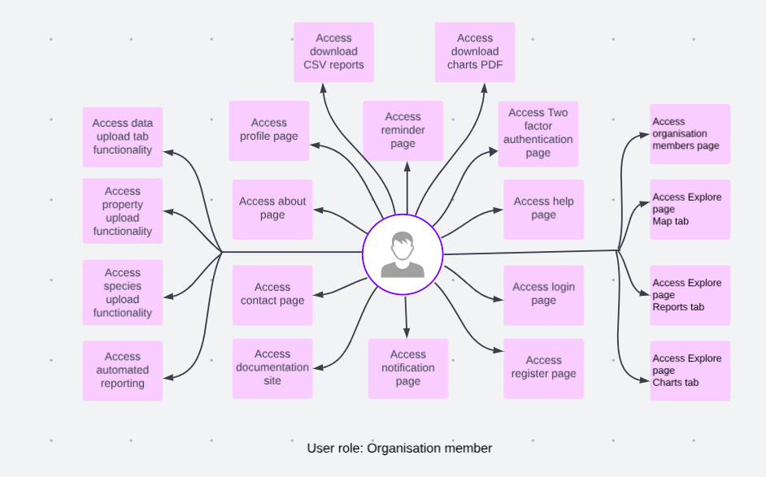
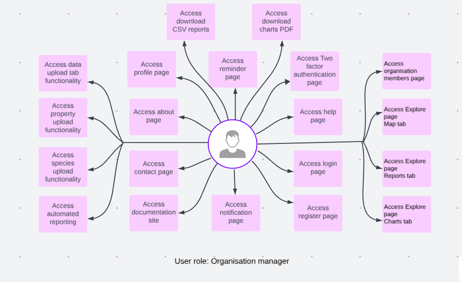
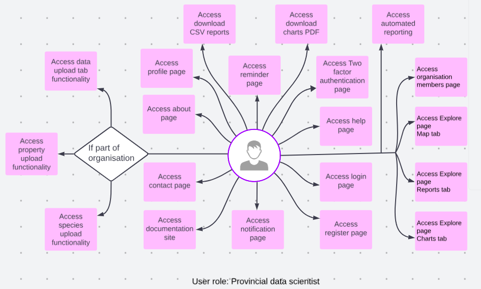
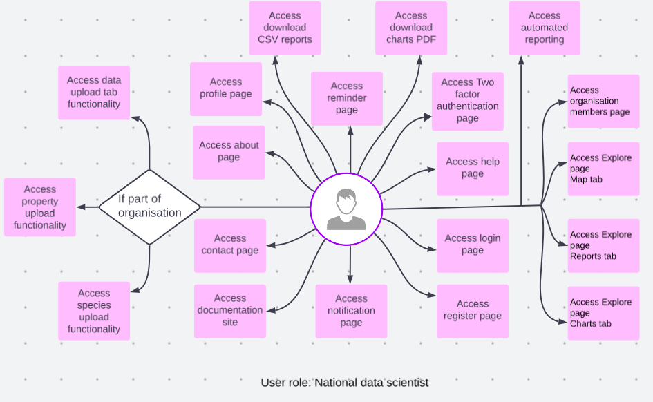

# User Roles Documentation

User roles are type of users in SAWPS affecting what they can do in the system.
There are currently 10 roles:

| Role                          | Description                                                                                                                                      |
|-------------------------------|--------------------------------------------------------------------------------------------------------------------------------------------------|
| **Unnamed user**              | A user on the internet who is not registered with the site.                                                                                      |
| **Floating user**             | A registered user who does not have an organisation and needs to request addition to/of organisation.                                            |
| **Organisation member**       | A user who is registered on the site and part of an organisation.                                                                                |
| **Organisation manager**      | A user who is registered on the site and part of an organisation that can add other members to the site.                                         |
| **Provincial data consumer**  | A decision-maker type user who has access to the site to consume aggregate data about the region but not property specific information.          |
| **National data consumer**    | A national decision-maker type user who has access to the site to consume aggregate data about the region but not property specific information. |
| **Provincial data scientist** | A provincial data reviewer that can view data down to property lever and use the data to e.g. planning and permitting.                           |
| **National data scientist**   | A national data reviewer that can view data down to property lever and use the data for e.g. planning and permitting.                            |
| **Site administrator**        | A SANBI staff member with superuser access to all functionality on the site and the Django admin page.                                           |
| **Statistician**              | A user who has access to the statistics portal and R code uploader.                                                                              |
## User Roles

1. **Unnamed user**: A user on the internet who is not registered with the site.

    

    * **Full access**: The unnamed user have full access to login, register, about, contact, and help page. Unnamed user can access documentation site.

2. **Floating user**: A registered user who does not have an organisation and needs to request addition to/of organisation.

    

    * **Full access**: The floating user have full access to login, register, about, contact, profile, notification, reminders, two-factor authentication and help page. Floating user can access documentation site.

3. **Organisation member**: A user who is registered on the site and part of an organisation.

    

    * **Full access**: The organisation member have full access to login, register, about, contact, profile, notification, reminders, two-factor authentication, help, data upload, property upload, and species upload page. Organisation member can access documentation site.

    * **Access with conditions**: The organisation member can access the following pages with conditions.

        1. **Organisation member page**: Can not add people to organisation.

        2. **Explore page map tab**: Can see their organisation properties and information on the map.

        3. **Explore page reports tab**: Can see data tables with information about properties for their organisation.

        4. **Explore page charts tab**: Can see data charts with information about properties for their organisation.

        5. **Automated reporting**: Only for organisation.

        6. **Download csv of data from filtered table**: Can only download reports for their organisation.

        7. **Download charts image**: Can only download charts for their organisation.

4. **Organisation manager**: A user who is registered on the site and part of an organisation that can add other members to the site.

    

    * **Full access**: The organisation manager have full access to login, register, about, contact, profile, notification, reminders, two-factor authentication, help, data upload, property upload, and species upload page. Organisation manager can access documentation site.

    * **Access with conditions**: The organisation manager can access the following pages with conditions.

        1. **Organisation member page**: Can not add people to organisation.

        2. **Explore page map tab**: Can see their organisation properties and information on the map.

        3. **Explore page reports tab**: Can see data tables with information about properties for their organisation.

        4. **Explore page charts tab**: Can see data charts with information about properties for their organisation.

        5. **Automated reporting**: Only for organisation.

        6. **Download csv of data from filtered table**: Can only download reports for their organisation.

        7. **Download charts image**: Can only download charts for their organisation.

5. **Provincial data consumer**: A decision-maker type user who has access to the site to consume aggregate data about the region but not property specific information.

    

    * **Full access**: The provincial data consumer have full access to login, register, about, contact, profile, notification, reminders, two-factor authentication, and help page. Provincial data consumer can access documentation site.

    * **Access with conditions**: The provincial data consumer can access the following pages with conditions.

        1. **Organisation member page**: Can only add organisation members if instated as a manager of an organisation/ their own organisation.

        2. **Explore page map tab**: Can see mapped aggregate data at a regional scale i.e. provincial, eg. number of properties per region, number of species per region, number or activities per region.

        3. **Explore page reports tab**: Can see data tables with aggregate data at a regional scale i.e. provincial, eg. number of properties per region, number of species per region, number or activities per region.

        4. **Explore page charts tab**: Can see data charts with aggregate data at a regional scale i.e. provincial, eg. number of properties per region, number of species per region, number or activities per region.

        5. **Automated reporting**: Only aggregate data for region.

        6. **Download csv of data from filtered table**: Can only download aggregate reports data for their region.

        7. **Download charts image**: Can only download aggregate charts data for their region.

6. **National data consumer**: A national decision-maker type user who has access to the site to consume aggregate data about the region but not property specific information.

    

    * **Full access**: The national data consumer have full access to login, register, about, contact, profile, notification, reminders, two-factor authentication, and help page. National data consumer can access documentation site.

    * **Access with conditions**: The national data consumer can access the following pages with conditions.

        1. **Organisation member page**: Can only add organisation members if instated as a manager of an organisation/ their own organisation.

        2. **Explore page map tab**: Can see mapped aggregate data at a South African scale i.e. provincial, eg. number of properties for South Africa, number of species for South Africa, number or activities for South Africa.

        3. **Explore page reports tab**: Can see data tables with aggregate data at a national scale i.e. provincial, eg. number of properties in south africa, number of species in South Africa, number or activities per South Africa.

        4. **Explore page charts tab**: Can see data charts with aggregate data at a national scale i.e. provincial, eg. number of properties in south africa, number of species in South Africa, number or activities per South Africa.

        5. **Automated reporting**: Only aggregate data for South Africa.

        6. **Download csv of data from filtered table**: Can only download aggregate reports data for South Africa.

        7. **Download charts image**: Can only download aggregate charts data for South Africa.

7. **Provincial data scientist**: A provincial data reviewer that can view data down to property lever and use the data to e.g. planning and permitting.

    

    * **Full access**: The provincial data scientist have full access to login, register, about, contact, profile, notification, reminders, two-factor authentication, and help page. Provincial data scientist can access documentation site.

    * **Access with conditions**: The provincial data scientist can access the following pages with conditions.

        1. **Organisation member page**: Can only add organisation members if instated as a manager of an organisation/ their own organisation.

        2. **Explore page map tab**: Can see all data on the map at property level fro their region and filter by organisation, year and species etc.

        3. **Explore page reports tab**: Can see all data on the sawps platform for all properties to property level, can filter by organisation, property and species, at a regional scale.

        4. **Explore page charts tab**: Can see all data on the sawps platform for all properties to property level, can filter by organisation, property and species, at a regional scale.

        5. **Data upload**: Can upload data if they are part of an organisation.

        6. **Property upload**: Can upload property if they are part of an organisation.

        7. **Species upload**: Can upload species if they are part of an organisation.

        8. **Automated reporting**: All types of report available for regions as per filtering by user.

        9. **Download csv of data from filtered table**: Can download all types of report available for regions as per filtering by user.

        10. **Download charts image**: Can download all types of charts available for regions as per filtering by user.

8. **National data scientist**: A national data reviewer that can view data down to property lever and use the data for e.g. planning and permitting.

    

    * **Full access**: The national data scientist have full access to login, register, about, contact, profile, notification, reminders, two-factor authentication, and help page. National data scientist can access documentation site.

    * **Access with conditions**: The national data scientist can access the following pages with conditions.

        1. **Organisation member page**: Can only add organisation members if instated as a manager of an organisation/ their own organisation.

        2. **Explore page map tab**: Can see all data on the map at property level for South Africa and filter by organisation, year and species etc.

        3. **Explore page reports tab**: Can see all data on the sawps platform for all properties to property level, can filter by organisation, property and species, for all of South Africa.

        4. **Explore page charts tab**: Can see all data on the sawps platform for all properties to property level, can filter by organisation, property and species, for all of South Africa.

        5. **Data upload**: Can upload data if they are part of an organisation.

        6. **Property upload**: Can upload property if they are part of an organisation.

        7. **Species upload**: Can upload species if they are part of an organisation.

        8. **Automated reporting**: All types of report available for South Africa as per filtering by user.

        9. **Download csv of data from filtered table**: Can download all types of report available for South Africa as per filtering by user.

        10. **Download charts image**: Can download all types of charts available for South Africa as per filtering by user.

9. **Site administrator**: A SANBI staff member with superuser access to all functionality on the site and the Django admin page.

    

    * **Full access**: The site administrator holds a privileged role with full access to all aspects of the website, as well as on the admin panel.

10. **Statistician**: A user who has access to the statistics portal and R code.

    

    * **Full access**: The statistician have full access to login, register, about, contact, profile, notification, reminders, two-factor authentication, help, organisation member, and explore(map tab) page. Statistician can access documentation site.

    * **Access with conditions**: The statistician can access explore(reports tab), explore(charts tab), data upload, property upload, species upload, and automated reporting page. Or download CSV report and download charts functionality.

## Assigning Roles

This section shows few method on how a user can obtain a role.

| Role                          | Assignment Method                                                                                                                                 |
|-------------------------------|---------------------------------------------------------------------------------------------------------------------------------------------------|
| **Organisation member**       | User makes [organisation request](./user-profile/request-organisation.md), or Site administrator invites a user to an organisation as member. |
| **Organisation manager**      | Site administrator invites a user to an organisation as manager.                                                                                  |
| **Provincial data consumer**  | Add `Provincial data consumer` to user group from User Table in [Django Admin page](../../administrator/manual/django-admin.md).                  |
| **National data consumer**    | Add `National data consumer` to user group from User Table in [Django Admin page](../../administrator/manual/django-admin.md).                    |
| **Provincial data scientist** | Add `Provincial data scientist` to user group from User Table in [Django Admin page](../../administrator/manual/django-admin.md).                 |
| **National data scientist**   | Add `National data scientist` to user group from User Table in [Django Admin page](../../administrator/manual/django-admin.md).                   |
| **Site administrator**        | Set user as staff and superuser from User Table in [Django Admin page](../../administrator/manual/django-admin.md)  .                             |
