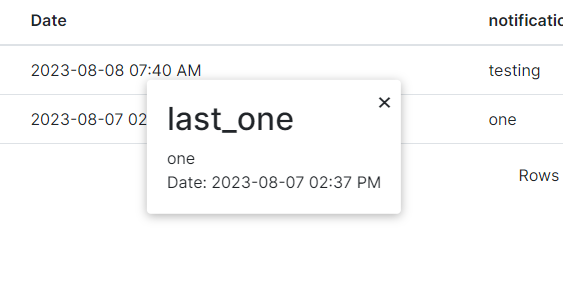

# Notifications Feature

## Description
*   The notifications feature allows for the user to receive push notifications of the reminders they have set via the platform.
*   When a notification comes in ,a small bell icon appears on the user profile icon.
*   Also a nav link for notifications becomes available in main nav dropdown. This allows for the user to view the notifications from any page on the system.
*   Clicking on the notification will lead the user to the notifications page where they can review more details about the notifications.
*   On the profile pages a small notif badge appears showing the number of notifications the user has.

Functionalities offered on the Notifications Page:
*	Searching specific notifications.
*	Searching by filtering.
*	Pagination.
*   deleting notifications.

## 1 Navigation Link
Under the profile section a tab for notifications is available. When clicked renders the notifications page.
## 2 Search box
Allows the user to search for a specific notification. The search looks for keywords within the notification and the title columns.
## 3 Filter
The user is able to filter by title or notification. This refines the search to only return notifications containing the providing keywords specifically by the filter selected.
## 4 Notification
Clicking on any notification will cause the pop up modal with notification information to appear.

## 5 Delete icon
*   The user can delete their notifications.
*   Organisation Managers can delete organisation notifications.
*   When the delete icon is clicked a pop up modal is evoked prompting if the user is sure of the actions they wish to take.

*   __1. Delete Confirmation Title__: Title pointing to what the modal is.
*   __2. Delete Button__: when clicked deletes the reminder.

## 6 Rows per page
The user is able to choose the number of notifications they prefer to see on a page. The minimum is 5.
## 7 Pagination Link
The user is able to see the current page they're own. They are also able to navigate to previous and next pages using the nav links.

