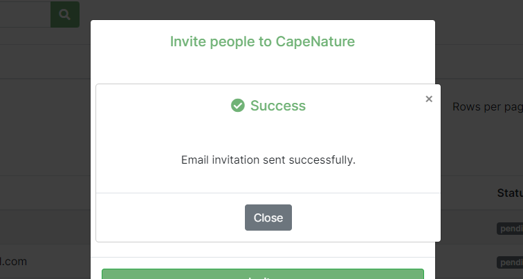

# Organisation Members

## Description
Every organization can manage their organization members via this page.

This page offers the following functionality:
*	Viewing organization members.
*	Inviting new members to the organization provided the user has the right permissions.
*	Deleting organization members provided the user has the right permissions.
*	Searching to see if a member exists within an organization.

## 1 Navigation
When the user clicks the dropdown icon next to their username and profile pictire, a dropdown nav will appear.
## 2 Navigation
Under the current organisation depending on the one that is currently selected, when clicked will navigate to the organisation members page.

*   __1 Organization name__: This is a heading that indicates to the user the current organization they are viewing.
*   __2 Add people button__: when clicked will evoke a pop-up modal.

*   __1 Email address field__: the user should provide the email address for the individual they wish to invite to the organization.
*   __2 Invite as field__: the user should specify if the individual they’re inviting will have a manager or member role within the organization.
*   __3 Permissions__: the user should specify the permissions the individual they’re inviting will have for the organization.
*   __4 Invite button__: when clicked will send the invitation to the individual being invited to the organization. A success message will show if the email has been sent.

*   __I. Email Invitation Email__: the individual being invited to the organization will receive this email.

*   __1 Register button__: the individual being invited should click the register button, they will be redirected to the website to complete their registration.
*    __I. New member on platform__: if the individual is a new member on the platform, they will be taken through the normal registration and added to the organisation.

*   __II. Member already registered on platform__: if the individual is not new on the platform they will just be registered on to the organisation they're being invited.

## 4 Search box:
this allows the user to search for a specific member within the members table.
## 5 rows per page:
this allows the user to determine how many rows they prefer to see on a single page. This can help on smaller deviecs for example.
## 6 Pagination:
indicates the current page the user is on. As well as the nav links to manuever to the previous or next page. 
## 7 Invitations table label:
this indicates to the user that the table below contains invites.
## 8 status: 
the invitations table has a status role that shows whether the individual whom has been invited has joined that organization yet.

