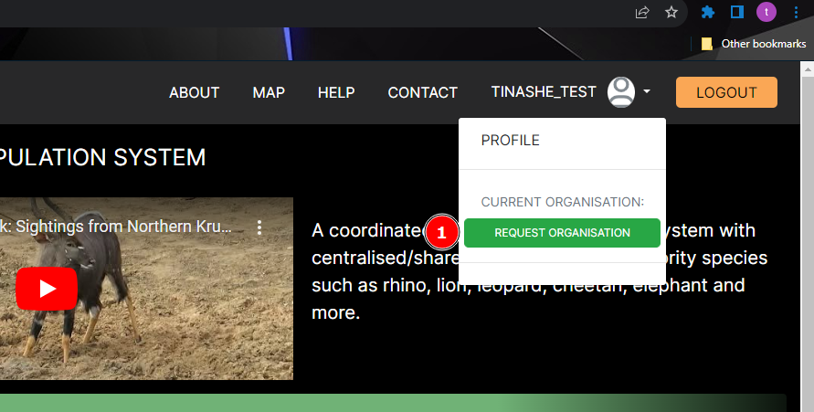
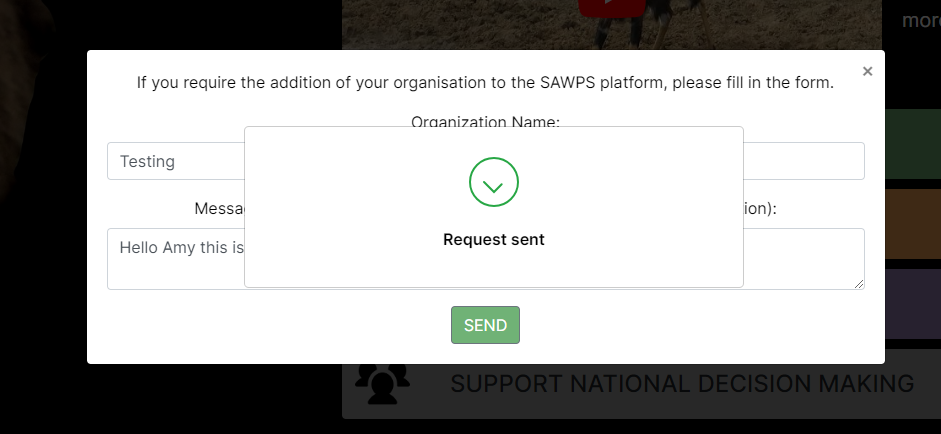

# Organisation Request Feature

## Description
When a user on the platform wishes to have an organisation. They can request for one.
-The sanbi administrator will review the request and if they approve will create the organisation for the user and notify them via email.

## 1 Request Organisation Link
*   This Link is under the nav dropown next to the profile icon in the header.
*   The Link is only visible to members without an organisation.
*   When the Link is clicked a pop modal is evoked.

## 1 Organization Name
In this field the user should provide the name/s of the organization they wish to have created.
## 2 Message to Administrator
The user requesting to have an organisation should provide a message providing a description of the organisation etc.
## 3 Send button
When the user clickes the send button , a confirmation will be returned to the user to let them know their invitation has been sent.

After these steps the user will now wait to receive feedback from the Sanbi administrator.

