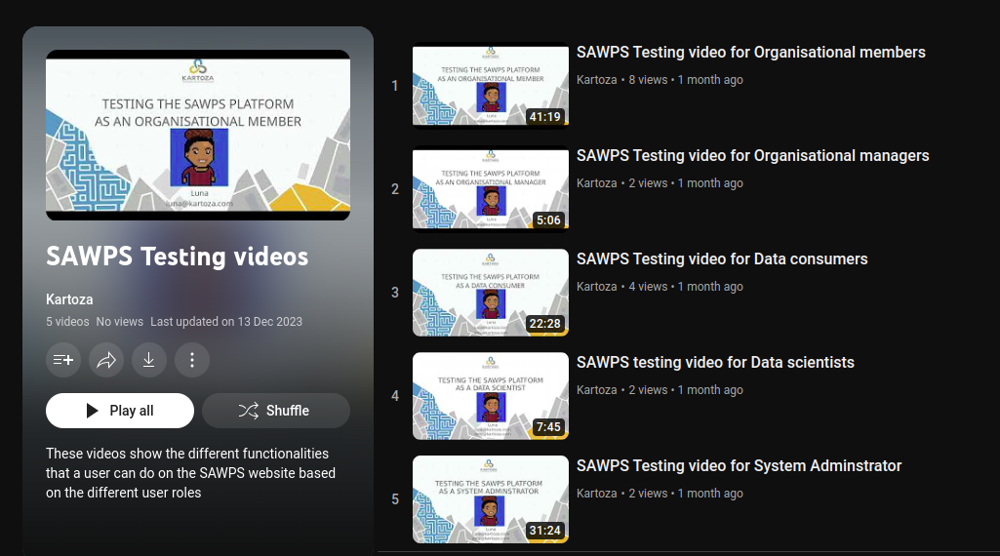

# Training Videos

The `Training Videos` provide a valuable resource for users to access instructional and educational content in video format. This section houses a diverse range of training videos covering various topics, functionalities, and best practices within the system.
> **Note:** These should be used in conjunction with the written guides and should not be used as a substitution.

- To view a playlist of all of the training videos, users can click on the image below.
    

Or users can watch the videos individually by navigating to the relative heading.

## Organisational Members

## Organisational Managers

## Data Consumers

## Data Scientists

## System Administrator

